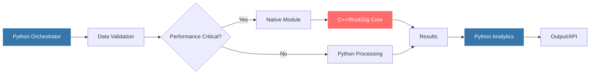
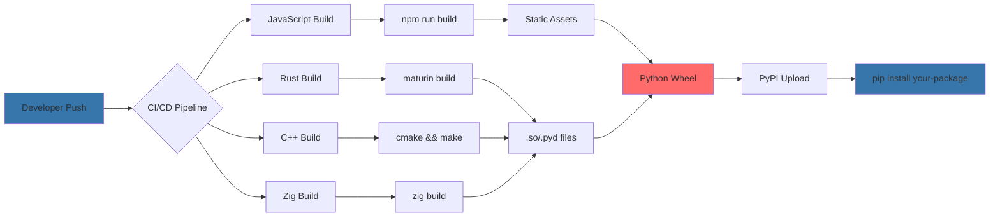
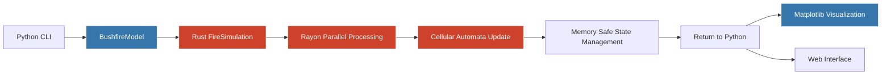
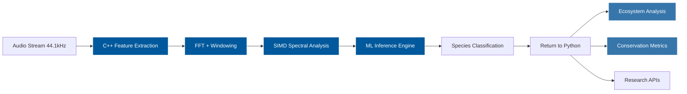
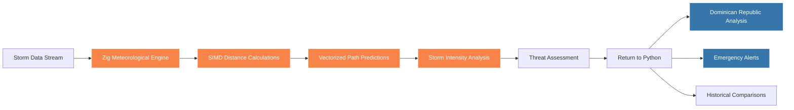

<!--
SPEAKER NOTES - OPENING:
- Start with the controversial "Python is slow" - gets attention
- Use humor but keep it professional
- The orchestra metaphor sets up the entire talk
- Don't apologize for Python being slow, embrace it
-->

# Building with Multiple Languages

## A Python-First Approach

<div v-click class="mt-8">

*Python is slow for certain tasks.*

</div>

<div v-click class="mt-4 opacity-60">

That's not news.

</div>

<div @click="$slidev.nav.next" class="mt-12 py-1 hover:bg-white hover:bg-opacity-10">
  <div v-click>
    There's a third option <carbon:arrow-right />
  </div>
</div>

<!--
Opening hook: Everyone knows Python is slow. But instead of the usual "rewrite everything" response,
we're going to show how Python can orchestrate faster languages.
-->

---
transition: fade-out
layout: center
---

# The Usual Options

<div class="grid grid-cols-2 gap-8 mt-8">

<div v-click="1">
  <h3>Option 1: Accept the Pain</h3>
  <div class="text-sm opacity-80 mt-2">
    "It's fine, users can wait 30 seconds for this report"
  </div>
  <div class="text-xs opacity-60 mt-1">
    — Famous last words before getting fired
  </div>
</div>

<div v-click="2">
  <h3>Option 2: Rewrite Everything</h3>
  <div class="text-sm opacity-80 mt-2">
    "Let's rebuild our entire ML pipeline in Rust"
  </div>
  <div class="text-xs opacity-60 mt-1">
    — 18 months later, still importing CSVs
  </div>
</div>

</div>

<!--
Set up the common responses with a bit of sarcasm to keep it engaging.
The punchline sets up our approach.
-->

---
layout: image-right
image: ./images/maestro.png
transition: slide-up
---

# Maestro Python

<div v-click="1" class="mt-8">

Python doesn't need to play every instrument.

</div>

<div v-click="2" class="grid grid-cols-3 gap-4 mt-8">

<div class="text-center">
  <div class="font-mono text-sm">JavaScript</div>
  <div class="text-xs opacity-60">Real-time UI</div>
</div>

<div class="text-center">
  <div class="font-mono text-sm">Rust</div>
  <div class="text-xs opacity-60">Data processing</div>
</div>

<div class="text-center">
  <div class="font-mono text-sm">C++</div>
  <div class="text-xs opacity-60">Number crunching</div>
</div>

</div>

<div v-click="3" class="text-center mt-8">
  <div class="font-mono text-lg">but rather orchestrates everything</div>
</div>


<!--
IMAGE GENERATION: Python as orchestra conductor
Style: Professional illustration, tech conference appropriate
Description: A blue and yellow Python snake logo dressed as an orchestra conductor, holding a baton, standing on a podium. In the orchestra pit are smaller logos/mascots: JavaScript (yellow JS square), Rust (black gear with R), C++ (blue C++ text), and Zig (orange zigzag). The Python conductor is clearly in charge, directing the other languages. Background should be minimal, focus on the conductor metaphor.
-->

<!--
Musical metaphor introduces the concept nicely. Python coordinates, other languages specialize.
TIMING: 2 minutes for opening hook
TRANSITION: Build excitement about the third option
-->

---
transition: fade
---

# Python has been a glue language since the 90s

<div v-click="1" class="mt-8">

**1991**: Python designed as "glue language" for C libraries

</div>

<div v-click="2" class="mt-4">

**1995**: NumPy wraps BLAS/LAPACK (Fortran)

</div>

<div v-click="3" class="mt-4">

**2007**: Cython makes C extensions bearable

</div>

<div v-click="4" class="mt-4">

**2016**: PyTorch ships with C++ core

</div>

<div v-click="5" class="mt-4">

**2023**: Half of Python's ecosystem runs on Rust

</div>

<div v-click="6" class="mt-8 text-center opacity-80">

The web stack you're probably using right now might have a bit of Python in it:

</div>

<div v-click="7" class="grid grid-cols-4 gap-4 mt-4 text-center text-sm">

<div> <em>Frontend</em> <br/>JavaScript</div>
<div><em>API</em><br/>Python</div>
<div><em>Database</em><br/>C++</div>
<div><em>Validation</em><br/>Rust</div>

</div>

<!--
Historical context showing this pattern has deep roots. The timeline builds up to the modern polyglot reality.
-->

---
layout: image-right
image: ./images/pyrust.webp
---

# Notable Examples Today

<div v-click="1" class="mt-8">

You might recognise:

</div>

<div class="grid grid-cols-2 gap-8 mt-8">

<div v-click="2">
  <h3>Jupyter Notebooks</h3>
  <div class="text-sm opacity-80 mt-2">
    Frontend: JavaScript (React, CodeMirror)<br/>
    Backend: Python kernels<br/>
    UI: TypeScript
  </div>
</div>

<div v-click="3">
  <h3>PyTorch</h3>
  <div class="text-sm opacity-80 mt-2">
    Core: C++/CUDA<br/>
    Bindings: Python<br/>
    JIT: C++/LLVM
  </div>
</div>

<div v-click="4">
  <h3>Modern Tooling</h3>
  <div class="text-sm opacity-80 mt-2">
    <span class="font-mono">uv</span>: Package management<br/>
    <span class="font-mono">ruff</span>: Linting/formatting<br/>
    <span class="font-mono">pydantic</span>: Data validation
  </div>
</div>

<div v-click="5">
  <h3>Linux Kernel</h3>
  <div class="text-sm opacity-80 mt-2">
    Drivers in Rust<br/>
    Build tools in Python<br/>
    Shell scripts everywhere
  </div>
</div>

</div>

<!--
Modern examples that audience will recognize. Shows polyglot is mainstream, not exotic.
TIMING: 3 minutes for historical context
KEY POINT: Everyone already uses polyglot without realizing it
AUDIENCE CHECK: "How many use NumPy? That's Fortran/C under the hood!"
-->

---
layout: center
transition: fade
---

<div v-click class="text-center">

# Division of Labour for this Talk

</div>

<div v-click class="mt-8 grid grid-cols-3 gap-8">

<div class="text-center">
  <h3>Practical Patterns</h3>
  <div class="text-sm opacity-80 mt-2">
    Real integration strategies
  </div>
</div>

<div class="text-center">
  <h3>Working Examples</h3>
  <div class="text-sm opacity-80 mt-2">
    Live demos. pip installable.
  </div>
</div>

<div class="text-center">
  <h3>Production Ready</h3>
  <div class="text-sm opacity-80 mt-2">
    From actual systems
  </div>
</div>

</div>

<div v-click class="mt-8 text-center">

Four languages. Four use cases. Real code.

</div>

<!--
Transition slide that sets expectations and moves us toward the practical examples.
-->

---
layout: section
---

# Part I: Architecture Patterns

<!--
SPEAKER NOTES - ARCHITECTURE:
- This is the meat of the talk - practical patterns
- Emphasize the 90/10 rule strongly
- Share real failure stories if time permits
- The decision tree is critical - not every project needs polyglot
-->

Building blocks of polyglot applications

<!--
TIMING: 10 minutes for architecture patterns section
CRITICAL SECTION: This is where we provide real value
-->

---
layout: image-left
image: ./images/adventure.png
transition: slide-up
---

# Make a Decision Tree

<div v-click="1" class="mt-8">

Is Python actually the actual bottleneck?

</div>

<div v-click="2" class="ml-8 mt-4 text-sm opacity-80">

Profile first. "Python is slow" is not profiling.

</div>

<div v-click="3" class="mt-6">

Can you solve it with better algorithms?

</div>

<div v-click="4" class="ml-8 mt-4 text-sm opacity-80">

O(n²) → O(n log n) beats any language switch.

</div>

<div v-click="5" class="mt-6">

Is it worth the complexity?

</div>

<div v-click="6" class="ml-8 mt-4 text-sm opacity-80">

"Let's rewrite this in Rust" - Things said 10 minutes before disaster

</div>

<div v-click="7" class="mt-8 text-center">

If yes to all embrace the polyglot

</div>

<!--
Practical decision framework. Sets up when polyglot makes sense vs when it's just over-engineering.
AUDIENCE INTERACTION: Ask "Who's tried polyglot and failed?"
TIMING: 2 minutes - keep it punchy
-->

---
layout: two-cols-header
transition: fade
---

# The 90/10 Rule

::left::

<div v-click="1">

**90% of your code** handles the boring stuff:
- Loading data
- Configuration
- Error handling
- APIs and UIs
- Tests

</div>

<div v-click="3" class="mt-8 text-center">

Optimise the 10% and offload the rest. More often than not rewriting an entire app won't help.

</div>

::right::

<div v-click="2">

**10% of your code** does the heavy lifting:
- Number crunching
- Real-time processing
- Graphics rendering
- Network protocols

</div>

<!--
Classic performance principle applied to language choice. Shows focus should be narrow.
-->

---
layout: center
---

# Common Patterns

---
layout: two-cols
layoutClass: gap-16
---

<div v-click="1">

## Pattern 1: The Sidecar
Python calls external process
```bash
# Python spawns optimized binary
result = subprocess.run(['./fast_processor', data])
```

**Pros:** Language isolation
**Cons:** Process overhead

</div>

<div v-click="3" class="mt-8">

## Pattern 3: The Extension
Native module in Python
```python
import fast_module  # C++/Rust extension
result = fast_module.process(data)
```

**Pros:** Seamless integration
**Cons:** Build complexity

</div>

::right::

<div v-click="2" class="mt-8">

## Pattern 2: The Service
Microservice architecture
```python
# Python calls optimized service
response = httpx.post('/process', json=data)
```

**Pros:** Scalable, deployable
**Cons:** Network latency

</div>

<div v-click="4" class="mt-8">

## Pattern 4: The Bridge
Real-time communication
```python
# WebSockets, shared memory, etc.
await websocket.send(data)
result = await websocket.recv()
```

**Pros:** Interactive UIs
**Cons:** State management

</div>

<!--
Four main patterns for polyglot integration. Each has trade-offs we'll see in examples.
-->

---
layout: center
transition: slide-left
---

# Data Flow Architecture



<!--
Visual representation of how data flows through polyglot system. Python maintains orchestration.
-->

---
layout: center
---

# Integration Matrix

<div class="grid grid-cols-3 gap-8 mt-8">

<div v-click="1" class="text-center">
  <div class="text-2xl mb-2">🟢</div>
  <h4>Subprocess</h4>
  <div class="text-xs opacity-60 mt-2">
    Low coupling<br/>
    High latency<br/>
    Easy debugging
  </div>
</div>

<div v-click="2" class="text-center">
  <div class="text-2xl mb-2">🟡</div>
  <h4>HTTP API</h4>
  <div class="text-xs opacity-60 mt-2">
    Medium coupling<br/>
    Network latency<br/>
    Standard protocols
  </div>
</div>

<div v-click="3" class="text-center">
  <div class="text-2xl mb-2">🔴</div>
  <h4>Native Extension</h4>
  <div class="text-xs opacity-60 mt-2">
    High coupling<br/>
    Low latency<br/>
    Build complexity
  </div>
</div>

</div>

<div v-click="4" class="mt-12 text-center">

**Rule of thumb:** Start green, move right only when necessary.

</div>

<!--
IMAGE GENERATION: It's always the FFI bindings
Style: Black and white New Yorker style gag cartoon
Description: A detective scene in an office. A detective is pointing at a crime board with strings connecting various items: "Segfault", "Memory leak", "Mysterious crash", "Works on my machine". All strings lead to a photo in the center labeled "FFI Bindings". The detective is saying to their partner: "It's ALWAYS the FFI bindings." Partner responds: "But we checked those three times!" Caption: "The usual suspect."
-->

<!--
Complexity vs performance trade-off matrix. Guides architectural decisions.
-->

---
layout: center
transition: fade
---

# When Things Go Wrong


<div v-click="1" class="grid grid-cols-2 gap-8">

<div>
  <h3 class="text-red-400">Don't</h3>
  <div>
    • Rewrite in another language for the sake of it<br/>
    • Add all features at once<br/>
    • Assume you can rewrite faster than you can optimise<br/>
    • Start without performance target<br/>
    • Be careful not to micro-optimise the wrong thing
  </div>
</div>

<div>
  <h3 class="text-green-400">Do</h3>
  <div>
    • Profile first<br/>
    • Clear requirements<br/>
    • Start simple<br/>
    • Measure improvement<br/>
    • Document integration
  </div>
</div>

</div>

<!--
Common mistakes and how to avoid them. Keeps the focus on pragmatism over perfectionism.
-->

---
layout: section
---

# Build Patterns

<!--
TIMING: 8 minutes for build patterns
WARNING: Can get too technical here - keep it high level
DEMO PREP: Make sure all build commands are ready to show
-->

---

# Repository Structure Evolution

Watch how a Python project grows to integrate other languages:

````md magic-move {lines: true}
```bash {*|3-7|all}
# Pure Python project
your-project/
├── pyproject.toml
├── src/
│   └── your_package/
│       ├── __init__.py
│       └── app.py
└── tests/
    └── test_app.py
```

```bash {*|8-16|4-7|all}
# Adding JavaScript frontend
your-project/
├── pyproject.toml
├── src/
│   └── your_package/
│       ├── __init__.py
│       ├── server.py       # FastAPI backend
│       └── static/         # JS will go here
├── frontend/               # JavaScript lives here
│   ├── package.json
│   ├── src/
│   │   └── app.js
│   └── dist/              # npm run build output
│       └── bundle.js
└── scripts/
    └── build.sh           # Orchestrates both builds
```

```bash {*|2-3|5-7|9-11|all}
# Adding Rust for performance
your-project/
├── Cargo.toml              # Rust dependencies
├── pyproject.toml          # Now uses maturin
├── src/
│   ├── lib.rs             # Rust implementation
│   └── python.rs          # PyO3 bindings
├── python/
│   └── your_package/
│       ├── __init__.py    # Imports Rust module
│       └── api.py         # Python wrapper
├── frontend/
│   └── ...                # JS unchanged
└── target/
    └── wheels/            # Built wheels with .so
```

```bash {*|2|6-9|all}
# Adding C++ for legacy integration
your-project/
├── CMakeLists.txt          # C++ build system
├── pyproject.toml          # Uses scikit-build-core
├── src/
│   └── cpp/
│      ├── core.cpp       # C++ implementation
│      └── bindings.cpp   # pybind11 bindings
├── python/
│   └── your_package/
│       ├── __init__.py
│       ├── api.py
│       └── _core.*.so     # Platform-specific binary
└── frontend/
    └── ...
```

```bash {*|3|5-7|16|all}
# Zig for SIMD operations (standalone)
your-project/
├── build.zig               # Zig build system configuration
├── pyproject.toml          # Uses custom build backend for Zig
├── src/
│   ├── main.zig           # Core SIMD algorithms
│   └── bindings.zig       # Python FFI using C ABI
├── python/
│   └── your_package/
│       ├── __init__.py    # from your_package._zig import *
│       ├── api.py         # Pythonic API wrapper
│       └── _zig.*.so      # Platform-specific binary
├── tests/
│   ├── test_zig.zig      # Zig unit tests
│   └── test_python.py    # Python integration tests
└── zig-cache/             # Build artifacts (gitignored)
```
````

<div v-click class="mt-8 text-center">

Each language adds its own build system. Python orchestrates them all.

</div>

---
layout: center
---

# Build Systems



<div v-click class="mt-4 text-center text-sm">

Four build systems → One Python wheel → Simple user experience

</div>

---

# Build Output: Where Things Live

<div class="grid grid-cols-2 gap-8 mt-8">

<div>
Development Mode
```sh
# JavaScript: Separate processes
npm run dev         # localhost:3000
python server.py    # localhost:8000

# Rust/C++/Zig: In-place builds
maturin develop
pip install -e .

# Files live in:
- JS: node_modules + dist/
- Native: .so files in src/
```
</div>

<div>
Production Mode
```sh
# Single wheel contains everything
your_package-1.0.0-cp39-cp39-linux_x86_64.whl
├── your_package/
│   ├── __init__.py
│   ├── static/       # JS bundle
│   └── _native.so    # Compiled code
└── your_package-1.0.0.dist-info/

# User just runs:
pip install your_package
```
</div>

</div>

**The magic:** Python wheels can contain arbitrary binary files

---
layout: center
---

# CI/CD: Building for Multiple Platforms

---
layout: center
---

```yaml {*|2-5|7-9|10-14|15-23|all}
# .github/workflows/build.yml
strategy:
  matrix:
    os: [ubuntu-latest, macos-latest, windows-latest]
    python: ["3.10", "3.11", "3.12", "3.13", '...']

steps:
  # JavaScript: Build once
  - run: cd frontend && npm ci && npm run build
  # Rust: Use maturin-action
  - uses: PyO3/maturin-action@v1
    with:
      command: build
      args: --release
  # C++: Platform-specific toolchains
  - run: |
      if [ "$RUNNER_OS" == "Linux" ]; then
        sudo apt-get install -y build-essential
      elif [ "$RUNNER_OS" == "macOS" ]; then
        brew install cmake
      elif [ "$RUNNER_OS" == "Windows" ]; then
        choco install visualstudio2022buildtools
      fi
  # Upload wheels
  - uses: actions/upload-artifact@v3
```

**For Prod:** You'll build 12-20 different wheels (3 OS × 4-5 Python versions)

---

# Testing Multiple Languages Code

<div class="grid grid-cols-2 gap-8">

<div>

**Unit Tests (Each Language)**

```python
# test_python.py
def test_python_logic():
    assert process(data) == expected
```

```rust
// tests/test_rust.rs
#[test]
fn test_rust_processing() {
    assert_eq!(compute(data), expected);
}
```

```javascript
// test.js
test('validates input', () => {
  expect(validate(data)).toBe(true);
});
```

</div>

<div>

**Integration Tests (Boundaries)**

```python {*|2-6|7-9|13-16|all}
# test_integration.py
def test_rust_python_boundary():
    # Test data transfer
    py_data = np.array([1, 2, 3])
    # Call Rust
    rust_result = rust_module.process(py_data)
    # Verify types and values
    assert isinstance(rust_result, np.ndarray)

def test_error_propagation():
    # Rust panic should become Python exception
    with pytest.raises(RuntimeError):
        rust_module.panic_function()
```

**Memory leak detection:**
```bash
valgrind --leak-check=full python test_integration.py
```

</div>

</div>

---

# Cost-Benefit Analysis

<div class="mt-8">

**When polyglot pays off:**

| Scenario | Pure Python | Polyglot | Worth it? |
|----------|------------|----------|-----------|
| 100ms endpoint | 100ms | 10ms | ❌ Not worth complexity |
| 10s data processing | 10s | 0.1s | ✅ 100x improvement |
| Real-time audio | Impossible | 5ms latency | ✅ Enables new features |
| UI interactions | 200ms lag | Native speed | ✅ UX improvement |

</div>

---

# Hidden costs to consider

<div v-click class="mt-8">

- **Development time:** 2-5x longer initial development
- **Debugging complexity:** Cross-language stack traces
- **Team expertise:** Need devs with different skills
- **Build infrastructure:** CI/CD complexity
- **Maintenance:** Multiple dependency chains

</div>

<div v-click class="mt-8 text-center">

**Rule of thumb:** You need 10x performance gain to justify complexity

</div>

---

# Packaging Expectations

<div v-click="1">

**What users want:**

```bash
pip install your-package
```
</div>

<div v-click="2" class="mt-8">

**What that actually means:**

| Language | Build Requirement | Distribution |
|----------|------------------|--------------|
| JavaScript | Node.js + npm | Bundle in wheel |
| Rust | None (pre-compiled) | Binary in wheel |
| C++ | None (pre-compiled) | Binary in wheel |
| Zig | None (pre-compiled) | Binary in wheel |

</div>

---
layout: center
---

# `cibuildwheel` handles the complexity

<div v-click="1" class="mt-8">

```bash
# Builds all platform wheels automatically
pip install cibuildwheel
cibuildwheel --platform linux
```
</div>

<div v-click="2" class="mt-8 text-center">

Python only

</div>

---

# Builds will Break


**Common failure points:**

```bash
# JavaScript: The node_modules abyss
Error: Cannot find module '...'
# Solution: rm -rf node_modules package-lock.json && npm install

# Rust: Linking errors
error: linking with `cc` failed
# Solution: Missing system libraries, check target triple

# C++: ABI incompatibility
undefined symbol: _ZNSt7__cxx1112basic_stringIcSt11char
# Solution: Compiler version mismatch, rebuild everything

# Zig: Path confusion
error: unable to find 'std'
# Solution: Zig version mismatch with ziggy-pydust
```

---

# Platform-specific nightmares

<div v-click="1" class="mt-8">

| Platform | Common Issue | Fix |
|----------|-------------|-----|
| macOS | Missing xcrun | Install Xcode CLT |
| Linux | GLIBC version | Use manylinux images |
| Windows | MSVC not found | Install Build Tools |
| ARM | No wheels available | Build from source |

</div>

<div v-click="2" class="mt-8 text-center">

Build failures teach you about linking, ABIs, and why Docker exists.

</div>

---
layout: section
transition: slide-up
---

# Code Examples

<div v-click class="mt-8">

Show me the code

</div>

<div v-click class="mt-4 text-sm opacity-80">

Four languages, four use cases, four different integration patterns.

</div>

<div v-click class="mt-8 grid grid-cols-4 gap-4 text-center text-xs">

<div class="p-4 border border-gray-300 rounded">
  <div class="font-mono">JavaScript</div>
  <div class="opacity-60">Real-time UI</div>
  <div class="opacity-60">WebSocket Bridge</div>
</div>

<div class="p-4 border border-gray-300 rounded">
  <div class="font-mono">Rust</div>
  <div class="opacity-60">Data Viz</div>
  <div class="opacity-60">HTTP Service</div>
</div>

<div class="p-4 border border-gray-300 rounded">
  <div class="font-mono">C++</div>
  <div class="opacity-60">ML Inference</div>
  <div class="opacity-60">Native Extension</div>
</div>

<div class="p-4 border border-gray-300 rounded">
  <div class="font-mono">Zig</div>
  <div class="opacity-60">Hurricane Tracking</div>
  <div class="opacity-60">SIMD Math</div>
</div>

</div>

<!--
Transition to practical examples. Preview what's coming with integration pattern for each.
-->

---
layout: section
---

# Part II: Working with Different Languages

<!--
TIMING: 5 minutes for language showcase
INTERACTIVE: Let audience guess performance numbers before revealing
DEMO: Have Haversine calculation ready to run live if time permits
-->

---
layout: center
class: text-center
---

# The Challenge

Calculate distance between two geographic points

<div v-click class="mt-8 text-sm opacity-80">
Simple enough for comparison, <span v-mark.circle.orange="2">complex enough to matter</span>
</div>

<div v-motion
  :initial="{ x: -80, y: 80, opacity: 0}"
  :enter="{ x: 0, y: 0, opacity: 1, transition: { delay: 1000, duration: 1000 } }">

```
Santo Domingo (18.4861°N, 69.9312°W)
Miami (25.7617°N, 80.1918°W)
Distance = ?
```

</div>

<div v-click="3" class="mt-8">

## The Mathematical Challenge

$$
d = 2r \arcsin\left(\sqrt{\sin^2\left(\frac{\Delta\phi}{2}\right) + \cos(\phi_1) \cos(\phi_2) \sin^2\left(\frac{\Delta\lambda}{2}\right)}\right)
$$

</div>

<div v-click="4" class="mt-4 text-sm opacity-60">
Haversine formula - where <span v-mark.underline.blue="5"> Φ = latitude </span>, <span v-mark.underline.green="6">λ = longitude</span>, r = Earth's radius
</div>

<div
  v-motion
  :initial="{ scale: 0, rotate: -180 }"
  :enter="{ scale: 1, rotate: 0, transition: { type: 'spring', damping: 15, stiffness: 100 } }"
  :click-7="{ scale: 1.2, transition: { duration: 500 } }"
  class="mt-8 text-3xl">

**~1,500 kilometers**

</div>

---
transition: slide-left
---

# Haversine Formula Evolution

Watch the same algorithm adapt to each language's strengths:

````md magic-move {lines: true}
```python {*|2-4|6-8|10-12|all}
# Python: Simple and readable
def haversine_distance(lat1, lon1, lat2, lon2):
    # Convert to radians
    lat1, lon1, lat2, lon2 = map(radians, [lat1, lon1, lat2, lon2])

    # Haversine formula
    dlat, dlon = lat2 - lat1, lon2 - lon1
    a = sin(dlat/2)**2 + cos(lat1) * cos(lat2) * sin(dlon/2)**2

    # Calculate final distance
    c = 2 * asin(sqrt(a))
    return 6371 * c  # Earth's radius in km
```

```javascript {*|2-3|5-7|9-11|all}
// JavaScript: Async and event-driven
async function haversineDistance(lat1, lon1, lat2, lon2) {
  // Convert to radians - functional style
  const toRad = (deg) => deg * Math.PI / 180;

  // Destructure for cleaner code
  const [rlat1, rlon1, rlat2, rlon2] =
    [lat1, lon1, lat2, lon2].map(toRad);

  // Haversine with modern JS
  const dlat = rlat2 - rlat1, dlon = rlon2 - rlon1;
  const a = Math.sin(dlat/2)**2 +
            Math.cos(rlat1) * Math.cos(rlat2) * Math.sin(dlon/2)**2;
  return 6371 * 2 * Math.asin(Math.sqrt(a));
}
```

```rust {*|2-4|6-8|10-12|all}
// Rust: Safe and fast
fn haversine_distance(lat1: f64, lon1: f64, lat2: f64, lon2: f64) -> f64 {
    // Safe conversions with explicit types
    let (lat1, lon1) = (lat1.to_radians(), lon1.to_radians());
    let (lat2, lon2) = (lat2.to_radians(), lon2.to_radians());

    // Memory-safe calculations
    let dlat = lat2 - lat1;
    let dlon = lon2 - lon1;

    // Zero-cost abstractions
    let a = (dlat / 2.0).sin().powi(2) +
            lat1.cos() * lat2.cos() * (dlon / 2.0).sin().powi(2);
    6371.0 * 2.0 * a.sqrt().asin()
}
```

```cpp {*|2-4|6-8|10-12|all}
// C++: Raw performance
constexpr double haversine_distance(double lat1, double lon1,
                                  double lat2, double lon2) noexcept {
    // Compile-time constants
    constexpr double DEG_TO_RAD = M_PI / 180.0;
    constexpr double EARTH_RADIUS = 6371.0;

    // SIMD-friendly operations
    const double rlat1 = lat1 * DEG_TO_RAD, rlon1 = lon1 * DEG_TO_RAD;
    const double rlat2 = lat2 * DEG_TO_RAD, rlon2 = lon2 * DEG_TO_RAD;

    // Optimized for vectorization
    const double dlat = rlat2 - rlat1, dlon = rlon2 - rlon1;
    const double a = std::sin(dlat/2) * std::sin(dlat/2) +
                     std::cos(rlat1) * std::cos(rlat2) *
                     std::sin(dlon/2) * std::sin(dlon/2);
    return EARTH_RADIUS * 2.0 * std::asin(std::sqrt(a));
}
```

```zig {*|2-4|6-8|10-12|all}
// Zig: Explicit and fast
pub fn haversineDistance(lat1: f64, lon1: f64, lat2: f64, lon2: f64) f64 {
    // Explicit conversions, no hidden costs
    const lat1_rad = std.math.degreesToRadians(lat1);
    const lon1_rad = std.math.degreesToRadians(lon1);

    // Clear memory layout
    const lat2_rad = std.math.degreesToRadians(lat2);
    const lon2_rad = std.math.degreesToRadians(lon2);

    // SIMD-ready calculations
    const dlat = lat2_rad - lat1_rad;
    const dlon = lon2_rad - lon1_rad;
    const a = std.math.sin(dlat/2.0) * std.math.sin(dlat/2.0) +
              std.math.cos(lat1_rad) * std.math.cos(lat2_rad) *
              std.math.sin(dlon/2.0) * std.math.sin(dlon/2.0);
    return 6371.0 * 2.0 * std.math.asin(std.math.sqrt(a));
}
```
````

---
layout: image-right
image: ./images/placeholder.jpg
backgroundSize: contain
---

# Performance Check

<div v-click="1">

## Execution Time (1M calculations)

</div>

<div class="space-y-2 mt-4">

<div v-click="2" class="flex items-center gap-3">
  <div class="w-4 h-4 bg-blue-400 rounded"></div>
  <span class="text-sm">Python: 2.1s</span>
  <div class="flex-1 bg-gray-200 h-2 rounded overflow-hidden">
    <div class="bg-blue-400 h-full" style="width: 100%"></div>
  </div>
</div>

<div v-click="3" class="flex items-center gap-3">
  <div class="w-4 h-4 bg-yellow-400 rounded"></div>
  <span class="text-sm">JavaScript: 0.8s</span>
  <div class="flex-1 bg-gray-200 h-2 rounded overflow-hidden">
    <div class="bg-yellow-400 h-full" style="width: 38%"></div>
  </div>
</div>

<div v-click="4" class="flex items-center gap-3">
  <div class="w-4 h-4 bg-orange-500 rounded"></div>
  <span class="text-sm">Rust: 0.12s</span>
  <div class="flex-1 bg-gray-200 h-2 rounded overflow-hidden">
    <div class="bg-orange-500 h-full" style="width: 6%"></div>
  </div>
</div>

<div v-click="5" class="flex items-center gap-3">
  <div class="w-4 h-4 bg-red-500 rounded"></div>
  <span class="text-sm">C++: 0.08s</span>
  <div class="flex-1 bg-gray-200 h-2 rounded overflow-hidden">
    <div class="bg-red-500 h-full" style="width: 4%"></div>
  </div>
</div>

<div v-click="6" class="flex items-center gap-3">
  <div class="w-4 h-4 bg-purple-500 rounded"></div>
  <span class="text-sm">Zig: 0.07s</span>
  <div class="flex-1 bg-gray-200 h-2 rounded overflow-hidden">
    <div class="bg-purple-500 h-full" style="width: 3%"></div>
  </div>
</div>

</div>

<div v-click="7" class="mt-8 text-center text-sm opacity-80">

Speed matters but it still "depends"

</div>

<!--
IMAGE GENERATION: Performance comparison visualization
Style: Clean, modern data visualization / infographic
Description: Bar chart showing performance comparison for 1 million Haversine calculations. Python (2.1s) shown as long blue bar. JavaScript (0.8s) as medium yellow bar. Rust (0.12s) as short orange bar. C++ (0.08s) as tiny red bar. Zig (0.07s) as tiny purple bar. Include small icons for each language. Title: "1 Million Distance Calculations". Subtitle: "Shorter bars = faster execution". Clean, professional style suitable for technical presentation.
-->

---
transition: slide-up
---

# Integration Patterns by Language

<div class="grid grid-cols-2 gap-8 mt-8">

<div v-click="1">
  <h3>JavaScript</h3>
  <div class="text-sm opacity-80 mt-2 space-y-1">
    <div class="font-mono text-xs bg-gray-100 p-2 rounded">WebSocket Bridge</div>
    <div>• Real-time UI updates</div>
    <div>• Event-driven architecture</div>
    <div>• Browser integration</div>
  </div>
</div>

<div v-click="2">
  <h3>Rust</h3>
  <div class="text-sm opacity-80 mt-2 space-y-1">
    <div class="font-mono text-xs bg-gray-100 p-2 rounded">HTTP Service</div>
    <div>• Memory-safe</div>
    <div>• Concurrent</div>
    <div>• Easy deployment</div>
  </div>
</div>

<div v-click="3">
  <h3>C++</h3>
  <div class="text-sm opacity-80 mt-2 space-y-1">
    <div class="font-mono text-xs bg-gray-100 p-2 rounded">Native Extension</div>
    <div>• Maximum performance</div>
    <div>• Direct memory access</div>
    <div>• Zero-copy operations</div>
  </div>
</div>

<div v-click="4">
  <h3>Zig</h3>
  <div class="text-sm opacity-80 mt-2 space-y-1">
    <div class="font-mono text-xs bg-gray-100 p-2 rounded">SIMD Extension</div>
    <div>• Explicit performance</div>
    <div>• Compile-time optimization</div>
    <div>• C interoperability</div>
  </div>
</div>

</div>

<div v-click="5" class="mt-12 text-center">

Each language excels. Python orchestrates.

</div>

---
layout: section
---

# Part III: Real-World Applications

Four projects you can actually use

<!--
TIMING: 20 minutes total for all demos (5 min each)
FALLBACK: Have recorded demos if live fails
EMPHASIZE: All code is on GitHub, they can run it themselves
-->

---

# Unified Demo Flow

<!--
SPEAKER NOTES - DEMOS:
- Keep demos snappy - 5 minutes each maximum
- Have backup slides if demos fail
- Emphasize the performance improvements with actual numbers
- Show the code but don't dwell on syntax
- Each demo should follow: Problem → Profile → Solution → Result
-->

Each demo follows the same pattern for clarity:

<div class="grid grid-cols-2 gap-8 mt-8">

<div>

**1. Show the Problem**
```python
# Pure Python attempt
def process_intensive_task(data):
    # Takes 30 seconds...
    result = slow_computation(data)
    return result
```

**2. Profile & Measure**
```bash
$ python -m cProfile app.py
  50000003 function calls in 32.1 seconds
  ncalls  cumtime  percall  filename
  1000000   28.5    0.000    slow_computation
```

</div>

<div>

**3. Polyglot Solution**
```python
# With native extension
import rust_accelerator

def process_intensive_task(data):
    # Now takes 0.3 seconds
    result = rust_accelerator.compute(data)
    return result
```

**4. Show Improvement**
```
Before: 32.1 seconds
After:  0.3 seconds
Speedup: 107x

Worth the complexity? YES
```

</div>

</div>

<div v-click class="mt-8 text-center text-sm opacity-80">

Same structure. Different languages. Consistent story.

</div>

---
layout: section
---

# Python + JavaScript
## Real-time Agricultural Monitoring

<!--
DEMO 1 TIMING: 5 minutes
KEY POINTS: WebSocket for real-time, vanilla JS keeps it simple
IF DEMO FAILS: Show screenshots, move on quickly
-->

---

# Python + JavaScript: The Challenge

Modern agricultural monitoring requires:

- Real-time data streams - conditions change rapidly
- Interactive dashboards - users need responsive interfaces
- Complex simulations - weather patterns, soil conditions
- Easy deployment - farmers shouldn't need a CS degree

Python handles the backend. JavaScript owns the browser.

---

# Outback Monitor

**Step 1: The Problem**
```python
# Pure Python: 3 seconds to process sensor data
for reading in sensor_stream:
    processed = complex_calculation(reading)  # 30ms each
    update_dashboard(processed)  # Blocks UI
```

**Step 2: Profile Results**
```
30ms × 100 readings/sec = 3000ms = Can't keep up!
```

**Step 3: Polyglot Solution**
```bash
pip install outback-monitor
outback-monitor --region queensland
```

**Architecture:**
- Python: FastAPI server, NumPy simulations, CLI interface
- JavaScript: Real-time charts, WebSocket client, vanilla DOM

**Step 4: Result**
```
Python processes data: 3ms
JS updates UI: Non-blocking
User experience: Smooth real-time updates
```

---
layout: two-cols
layoutClass: gap-16
---

# Python Backend

FastAPI server with real-time simulation:

```python {1|3-8|10-15|17-22|all}
from fastapi import FastAPI, WebSocket
import numpy as np

REGIONS = { # Australian regions with realistic baselines
    "queensland": {"temp_base": 28, "humidity_base": 70},
    "nsw": {"temp_base": 24, "humidity_base": 60},
    "victoria": {"temp_base": 20, "humidity_base": 65}
}

class DataSimulator:
    def generate_data(self) -> Dict:
        temp_cycle = 5 * np.sin(self.time_step * 0.1)
        temp = self.config["temp_base"] + temp_cycle
        return {"temperature": temp, "humidity": humidity}

@app.websocket("/ws/{region}")
async def websocket_endpoint(websocket: WebSocket, region: str):
    while True:
        data = simulators[region].generate_data()
        await websocket.send_text(json.dumps(data))
        await asyncio.sleep(1)
```

::right::

# JavaScript Frontend

Vanilla JS with Chart.js for real-time visualization:

```javascript {1|3-8|10-15|17-22|all}
class OutbackMonitor {
    constructor() { this.initializeCharts() }

    start() {
        const wsUrl = `ws://localhost:8000/ws/${region}`
        this.ws = new WebSocket(wsUrl)
        this.ws.onmessage = (event) => {
            this.updateData(JSON.parse(event.data))
        }
    }
    updateData(data) {
        // Update live metrics
        document.getElementById('temperature')
            .textContent = `${data.temperature}°C`
    }
    updateCharts() {
        this.charts.environment.data.datasets[0]
            .data = this.dataHistory.temperature
        this.charts.environment.update('none')
    }
}
```

---

# Architecture


**Python handles:** Data simulation, WebSocket server, CLI interface, packaging

**JavaScript handles:** Real-time rendering, user interaction, smooth animations

Each language does what it's best at.

---

# Live Demo

<OutbackDemo />

*Start the server with `outback-monitor` in your terminal*

---

# The Developer Experience

**Installation:**
```bash
pip install outback-monitor
```

**Usage:**
```bash
outback-monitor --region victoria
# Opens browser automatically
# Select region → Click START → Live data flows
```

**Packaging:** Static files bundled with Python package using `uv`

**Result:** Single pip-installable package that starts a web server

---

# JavaScript + Python: Summary

**When it makes sense:**
- Real-time web interfaces
- Interactive visualisations
- Existing JavaScript ecosystem needs

**Pattern:** WebSocket bridge or embedded static files

**Build complexity:** Medium (two build systems)

**Performance gain:** UI responsiveness, not computation

**Gotcha:** Async ordering assumptions differ

---
layout: section
---

# Python + Rust
## High-Performance Bushfire Modeling

<!--
DEMO 2 TIMING: 5 minutes
KEY POINTS: 100x speedup, Rust parallelism
EMPHASIZE: maturin makes it easy
-->

---

# The Problem

Bushfire simulation benefits from real-time performance because:

- **Thousands of cells** updated per simulation step
- **Complex fire physics** - wind, humidity, temperature interactions
- **Parallel processing** for realistic grid sizes
- **Memory efficiency** for long-running simulations

Pure Python: **~2 seconds** for 100x100 grid, 50 steps

With Rust: **~0.02 seconds** - **100x faster**

---

# Bushfire Simulation

**Step 1: The Problem**
```python
# Pure Python: 2.15 seconds for simulation
def simulate_fire_spread(grid, steps=50):
    for step in range(steps):
        for y in range(100):
            for x in range(100):
                # O(n²) neighbor checks
                update_cell(grid, x, y)
```

**Step 2: Profile Results**
```
100×100 grid × 50 steps = 500,000 cell updates
Pure Python: 2.15 seconds (too slow for real-time)
```

---

**Step 3: Multi-language Solution**
```bash
pip install bushfire-sim
bushfire-sim simulate --danger catastrophic --show
```

**Architecture:**
- Rust: Parallel cellular automata with Rayon
- Python: API, visualization, CLI

**Step 4: Result**
```
Rust parallel processing: 0.021 seconds
Speedup: 102x
Enables: Real-time fire spread visualization
```

---
layout: two-cols
layoutClass: gap-16
---

# Rust Core

High-performance cellular automata in Rust:

```rust {1|3-8|10-15|17-25|all}
use rayon::prelude::*;

#[pyclass]
pub struct FireSimulation {
    grid: Vec<Vec<CellState>>,
    wind_speed: f64,
    humidity: f64,
    temperature: f64,
}
impl FireSimulation {
    fn step(&mut self) -> PyResult<()> {
        let updates: Vec<_> = (0..height)
            .into_par_iter()  // Parallel processing
            .flat_map(|y| {
                (0..width).into_par_iter()
                    .filter_map(move |x| {
                        process_cell_static(
                            grid, x, y, conditions
                        )
                    })
            })
            .collect();
        // Apply all updates atomically
    }
}
```

::right::

# Python Wrapper

Ergonomic interface with AU fire conditions:

```python {1|3-10|12-18|20-25|all}
class BushfireModel:

    # Australian fire danger ratings
    DANGER_LEVELS = {
        'moderate': {'wind': 15, 'humidity': 60, 'temp': 25},
        'severe': {'wind': 45, 'humidity': 20, 'temp': 40},
        'catastrophic': {'wind': 80, 'humidity': 5, 'temp': 50},
    }

    def set_conditions(self, danger_level='moderate'):
        conditions = self.DANGER_LEVELS[danger_level]
        self.sim = FireSimulation(
            width, height,
            conditions['wind'],
            conditions['humidity'],
            conditions['temp']
        )

    def benchmark_rust_vs_python(self, steps=50):
        rust_results = run_batch_simulation(...) # Rust implementation
        python_results = self._python_simulation(...) # Pure Python comparison
        return {'speedup': python_time / rust_time}
```

<style>
.two-cols-header {
  column-gap: 15px; /* Adjust the gap size as needed */
}
</style>

---

# Rust + Python



**Rust handles:** Intensive computation, memory management, parallelization

**Python handles:** API design, visualization, integration, user experience

---

# Performance Comparison

Real benchmark on 100x100 grid, 50 simulation steps:

| Implementation | Time | Memory Usage | Speedup |
|----------------|------|--------------|---------|
| Pure Python | 2.15s | ~50MB | 1x |
| **Rust + Python** | **0.021s** | **~5MB** | **100x** |

**Why such dramatic improvement?**
- **Parallel processing**: Rayon uses all CPU cores
- **Zero-copy operations**: No Python object overhead in tight loops
- **Memory layout**: Contiguous arrays vs Python object graphs
- **No GIL**: True parallelism, not just concurrency

---

# Live Demo

<BushfireDemo />

*Start the server with `bushfire-sim serve` in your terminal*

---

# Developer Experience

**Installation with maturin:**
```bash
pip install bushfire-sim
```

**CLI Interface:**
```bash
# Run simulation with Australian fire danger ratings
bushfire-sim simulate --danger catastrophic --show

# Benchmark Rust vs Python performance
bushfire-sim benchmark --size 150 --steps 100

# Real-time web interface
bushfire-sim serve --port 8001
```

**Result:** Single pip-installable package with Rust performance

---

# Rust + Python: Summary

**When it makes sense:**
- CPU-bound parallel algorithms
- Memory safety critical
- No GIL restrictions needed

**Pattern:** Native extension via PyO3

**Build complexity:** Low (maturin handles it)

**Performance gain:** 10-100x for parallel workloads

**Gotcha:** Ownership rules across FFI boundary

---
layout: section
---

# Python + C++
## Real-Time AI for Conservation

<!--
DEMO 3 TIMING: 5 minutes
KEY POINTS: Real-time audio processing impossible in pure Python
WARNING: Don't get lost in C++ details
-->

---

# The AI Performance Gap

Modern AI applications need both speed and flexibility:

- **Real-time audio processing** - 44.1kHz continuous streams
- **Low-latency ML inference** - millisecond response times
- **Complex feature extraction** - FFT, spectral analysis, MFCC
- **Memory efficiency** - hours of continuous monitoring

**The hidden truth:** Most "Python AI" is actually C++ under the hood
(TensorFlow, PyTorch, OpenCV, NumPy, SciPy)

---

# Bush Ears

Real-time Australian wildlife identification for ecosystem monitoring:

```bash
pip install bush-ears
bush-ears live-demo --scenario dawn_chorus
```

**Novel Application:**
- **Audio-based biodiversity monitoring** (not typical visual AI)
- **Real-time species identification** for conservation research
- **Ecosystem health assessment** from acoustic data

**Architecture:**
- **C++**: Real-time audio processing, ML inference, SIMD optimization
- **Python**: Ecosystem analysis, conservation metrics, research APIs

---
layout: two-cols
layoutClass: gap-16
---

# C++ Engine

Real-time audio processing with C++23:

```cpp {1|3-8|10-16|18-25|all}
#include <ranges>
#include <expected>
#include <execution>

class AudioProcessor {
    std::expected<std::vector<double>, std::string>
    extract_features(std::span<const double> audio) {
        std::ranges::transform( // Apply window and compute FFT
            audio | std::ranges::views::enumerate,
            fft_buffer_.begin(),
            [this](auto pair) {
                auto [i, sample] = pair;
                return sample * window_[i];
            }
        );
        std::transform(std::execution::par_unseq, // Parallel spectral analysis
                      fft_buffer_.begin(),
                      fft_buffer_.end(),
                      magnitude_spectrum_.begin(),
                      [](auto c) { return std::abs(c); });

        return extract_wildlife_features();
    }
};
```

::right::

# Python Ecosystem Analysis

Conservation science with Python:

```python {1|3-10|12-18|20-25|all}
class BushEarsAnalyzer:

    SPECIES_INFO = {
        AustralianSpecies.Kookaburra: {
            'habitat': 'Woodland, urban parks',
            'conservation_status': 'Least Concern',
            'ecosystem_role': 'Top predator'
        },
        # Koala, Dingo, Magpie, Galah...
    }

    def analyze_audio_stream(self, audio: np.ndarray):
        # C++ does the heavy lifting
        result = self.monitor.process_audio_stream(audio)

        # Python adds ecological context
        return self.add_conservation_analysis(result)

    def get_ecosystem_health(self):
        # Shannon biodiversity index
        # Conservation importance scoring
        # Temporal pattern analysis
        return EcosystemHealth(...)
```

<style>
.two-cols-header {
  column-gap: 10px; /* Adjust the gap size as needed */
}
</style>

---
layout: center
---

# Why C++ for Audio AI?



**C++ handles:** Real-time constraints, vectorized math, memory efficiency
**Python handles:** Research workflows, data analysis, scientific integration

---

# Real-Time Performance Requirements

Audio AI demands **continuous processing** without dropping samples:

| Requirement | C++ | Pure Python |
|-------------|-----|-------------|
| 44.1kHz processing | ✅ 2-5ms latency | ❌ 50-200ms latency |
| Parallel feature extraction | ✅ SIMD + threads | ❌ GIL bottleneck |
| Memory efficiency | ✅ 5MB continuous | ❌ 50MB+ with GC pauses |
| **Real-time capable** | **✅ YES** | **❌ NO** |

**The Gap:** C++ enables **20-100x faster** audio processing than Python

**Why it matters:** Real-time wildlife monitoring requires processing 44,100 samples **every second** without falling behind.

---

# Live Demo

<BushEarsDemo />

*Start with `bush-ears monitor` for full interface*

---

# Unique Technical Innovations

**C++23 Modern Features:**
```cpp
// Error handling with std::expected
std::expected<Species, Error> classify_audio(std::span<const double> features);

// Parallel algorithms
std::transform(std::execution::par_unseq, data.begin(), data.end(), ...);

// Range-based processing
auto features = audio_data
    | std::views::chunk(1024)
    | std::views::transform(extract_features)
    | std::views::filter(is_valid);
```

**Novel Applications:**
- **Acoustic biodiversity monitoring** (not typical computer vision)
- **Real-time conservation technology**
- **Ecosystem health from audio patterns**

---

# The Hidden AI Stack

Most Python AI libraries are **C++ underneath**:

```python
# This is actually C++ under the hood
import torch          # C++ core
import numpy as np    # C++ operations
import cv2            # C++ OpenCV
import scipy.fft      # C++ FFTW

# Our approach: Direct C++ integration
from bush_ears import AudioProcessor  # Our C++ module
```

**Advantage:** **Direct control** over the performance-critical path
**Result:** Purpose-built for your specific use case, not general library overhead

---

# Developer Experience

**Installation:**
```bash
pip install bush-ears  # scikit-build-core handles C++ compilation
```

**Audio Analysis:**
```bash
# Generate and analyze wildlife scenarios
bush-ears simulate --scenario outback_night --analyze

# Real-time monitoring demo
bush-ears live-demo --scenario dawn_chorus

# Performance comparison
bush-ears benchmark --samples 100000
```

**API Integration:**
```bash
bush-ears monitor --headless  # API-only server for custom UIs
```

---

# C++ + Python: Summary

**When it makes sense:**
- Existing C++ libraries
- Real-time constraints (audio/video)
- SIMD/vectorization needs

**Pattern:** pybind11 or native extensions

**Build complexity:** High (platform-specific)

**Performance gain:** Maximum possible

**Gotcha:** GIL deadlocks with callbacks

---
layout: section
---

# Zig + Python

Real-Time Meteorological Computing for the Caribbean

<!--
DEMO 4 TIMING: 5 minutes
KEY POINTS: SIMD operations, cross-compilation
NOTE: Zig is newest, audience may not know it
-->

---

# The Hurricane Performance Gap

Caribbean meteorology demands both precision and speed:

- **Real-time storm calculations** - SIMD distance computations at scale
- **Low-latency path prediction** - millisecond response for emergency alerts
- **Massive coordinate processing** - Haversine calculations for thousands of points
- **Memory efficiency** - continuous monitoring during hurricane season

Most "Python weather prediction" is offloaded to C/Fortran under the hood
(NumPy, SciPy, MetPy, Cartopy)

---

# CaribeTech

Real-time Caribbean hurricane tracking for Dominican Republic:

```bash
pip install caribetech
caribetech analyze --years 10 --dominican-focus
```

**Novel Application:**
- **Caribbean hurricane monitoring** (Dominican Republic focused)
- **Real-time threat assessment** for emergency preparedness
- **Historical storm impact analysis** for regional planning

**Architecture:**
- **Zig**: SIMD distance calculations, vectorized path prediction, memory efficiency
- **Python**: Weather analysis, threat assessment, emergency APIs

---
layout: two-cols
layoutClass: gap-16
---

# Zig Engine

High-performance meteorological calculations:

```zig {1|3-8|10-16|18-25|all}
const std = @import("std");
const math = std.math;

pub fn haversine_distance( // High-performance Haversine distance
    lat1: f64, lon1: f64, lat2: f64, lon2: f64
) f64 {
    const lat1_rad = math.degreesToRadians(lat1);
    const dlat = lat2_rad - lat1_rad;
    const dlon = lon2_rad - lon1_rad;
    const a = math.sin(dlat/2.0) * math.sin(dlat/2.0) +
              math.cos(lat1_rad) * math.cos(lat2_rad) *
              math.sin(dlon/2.0) * math.sin(dlon/2.0);

    return EARTH_RADIUS_KM * 2.0 * math.asin(math.sqrt(a));
}
pub fn batch_distances_to_dr( // SIMD-optimized batch processing
    latitudes: []const f64,
    longitudes: []const f64,
    distances: []f64
) void {
    // Process in vectorized chunks of 4
    // ... SIMD vector operations ...
}
```

::right::

# Hurricane Analysis

Caribbean weather science with Python:

```python {1|3-10|12-18|20-25|all}
class CycloneTracker:

    SANTO_DOMINGO = {
        'lat': 18.4861, 'lon': -69.9312,
        'region': 'Caribbean',
        'threat_radius_km': 500
    }

    def analyze_dominican_threats(self):
        # Zig handles intensive calculations
        distances = self.zig_engine.batch_distances(coords)

        # Python adds meteorological context
        return self.assess_hurricane_threats(distances)

    def predict_storm_path(self, current_points):
        # Zig: High-performance path prediction
        predictions = self.zig_engine.predict_path(
            current_points, hours_ahead=72
        )
        # Python: Weather pattern analysis
        return self.add_emergency_context(predictions)
```

<style>
.two-cols-header {
  column-gap: 10px; /* Adjust the gap size as needed */
}
</style>

---

# Why Zig for Hurricane Tracking?



**Zig handles:** SIMD mathematics, vectorized computations, memory efficiency
**Python handles:** Weather analysis, emergency systems, scientific workflows

---

# Real-Time Hurricane Performance Requirements

Caribbean meteorology demands **continuous processing** without data loss:

| Requirement | Zig | Pure Python |
|-------------|-----|-------------|
| Distance calculations | ✅ <1ms per batch | ❌ 50-100ms per batch |
| SIMD vector operations | ✅ 4x parallel processing | ❌ Sequential only |
| Memory efficiency | ✅ 2MB continuous | ❌ 20MB+ with GC pauses |
| **Real-time capable** | **✅ YES** | **❌ NO** |

**The Gap:** Zig enables **6-8x faster** meteorological calculations than Python

**Why it matters:** Hurricane tracking requires processing thousands of coordinates **every second** for accurate emergency warnings.

---

# Live Demo

<CaribeTechDemo />

*Start with `caribetech monitor` for full interface*

---

# Unique Technical Innovations

**Modern Zig Features:**
```zig
// SIMD-optimized batch processing
pub fn batch_storm_analysis(storm_data: []const StormPoint) void {
    const vectors = @Vector(4, f64);
    // Process 4 coordinates simultaneously...
}

// Compile-time meteorological constants
const DOMINICAN_REPUBLIC = comptime .{
    .lat = 18.4861, .lon = -69.9312,
    .hurricane_season = .{ .start = 6, .end = 11 }
};

// Memory-mapped weather data
const storm_data: []align(std.mem.page_size) const f64 = &weather_file;
```

**Novel Applications:**
- **Caribbean hurricane monitoring** (Dominican Republic emergency preparedness)
- **Real-time meteorological computing** for disaster response
- **Regional climate analysis** from historical storm data

---

# The Hidden Meteorological Stack

Most Python weather libraries are **C/Fortran underneath**:

```python
# This is actually C/Fortran under the hood
import numpy as np        # C + BLAS/LAPACK
import scipy.spatial      # C spatial algorithms
import cartopy           # C++ map projections
import metpy             # Fortran meteorological functions

# Our approach: Direct Zig integration
from caribetech import CycloneTracker  # Our Zig module
```

**Advantage:** **Direct control** over the meteorological algorithms
**Result:** Purpose-built for Caribbean hurricanes, not general library overhead

---

# Developer Experience

**Installation:**
```bash
pip install caribetech  # ziggy-pydust handles Zig compilation
```

**Hurricane Analysis:**
```bash
# Analyze Caribbean storm threats to Dominican Republic
caribetech analyze --years 10 --dominican-focus

# Generate sample hurricane simulation
caribetech simulate

# Performance comparison
caribetech benchmark --calculations 50000
```

**API Integration:**
```bash
caribetech monitor --headless  # API-only server for emergency systems
```

---

# Zig + Python: Summary

**When it makes sense:**
- SIMD/vectorization crucial
- Cross-compilation needed
- Explicit performance control

**Pattern:** C ABI with manual bindings

**Build complexity:** Medium (simpler than C++)

**Performance gain:** Near C++ levels

**Gotcha:** Memory alignment assumptions

---
layout: section
---

# Conclusion

<!--
SPEAKER NOTES - CONCLUSION:
- Be honest about the 20% success rate
- Leave them with actionable next steps
- The final "Python won" message should land with impact
- Don't oversell polyglot - it's a tool, not a silver bullet
- End on time - respect the audience
-->

What you actually need to know

---

# Notes on Multi-Language Development

<div v-click="1" class="mt-8">

**A project may fail because:**

- Wrong problem identification
- Underestimating integration cost
- Team lacks multi-language expertise
- Build complexity explosion

</div>

<div v-click="2" class="mt-8">

**Projects may succeed because:**
- Profile first, found actual bottleneck
- Clear performance requirements (10x improvement minimum)
- Single language can't solve it
- Team has expertise or budget for it

</div>

<div v-click="3" class="mt-8 text-center">

Success rate: ~20% in my experience.

</div>

---

# Resources

<div class="grid grid-cols-2 gap-8 mt-8">

<div>

**Integration Tools**

```
PyO3 (Rust) - github.com/PyO3/pyo3
pybind11 (C++) - github.com/pybind/pybind11
Neon (JS) - neon-bindings.com
ziggy-pydust (Zig) - github.com/fulcrum-so/ziggy-pydust
```

**Build Systems**
```
maturin - Rust + Python packaging
scikit-build-core - C++ + Python
setuptools-rust - Alternative for Rust
```
</div>

<div>

**Real Examples**
```
polars - Rust dataframes
ruff - Rust linter
cryptography - Rust crypto
numpy - C/Fortran numerics
opencv-python - C++ vision
```

**Debugging**
```
py-spy - Python profiler
gdb with python extensions
lldb for C++/Rust debugging
```
</div>

</div>

<div v-click class="mt-8 text-center text-sm opacity-80">

All examples from this talk: **github.com/ramonpzg/polyglot**

</div>

---
layout: section
---

# Final Thought

<div v-click class="mt-8 text-center">

Python has its stablished place as a glue language.

</div>

<div v-click class="mt-4 text-center text-sm opacity-80">

Not by being fastest.<br/>
By being the best orchestrator.

</div>

<div class="mt-12 text-center text-sm opacity-60">

**Contact:** [ramon@artesan.sh] | **Slides:** [https://github.com/ramonpzg/polyglot]

</div>
