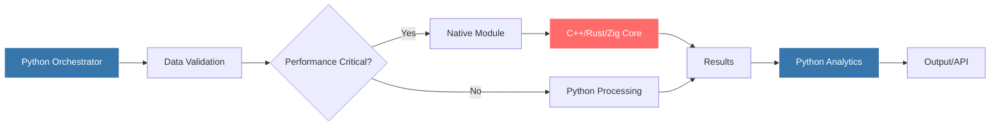
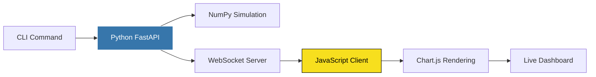
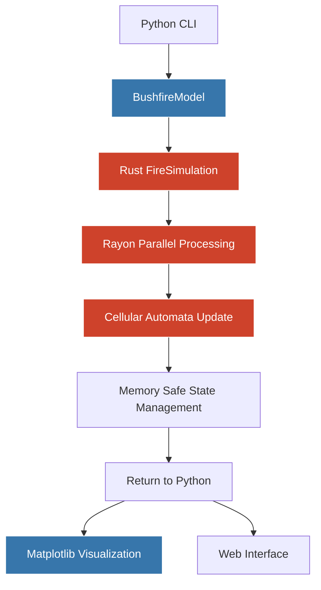
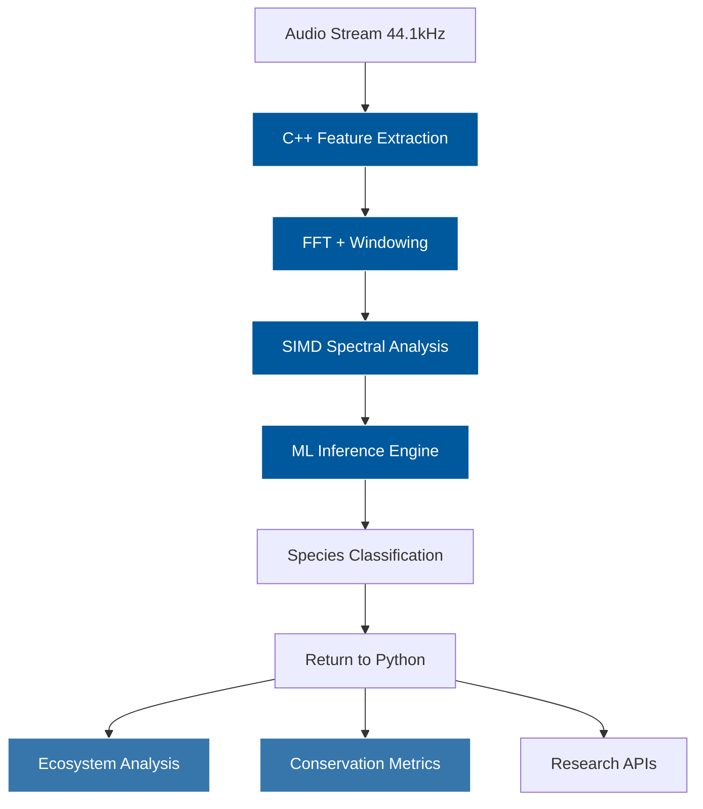
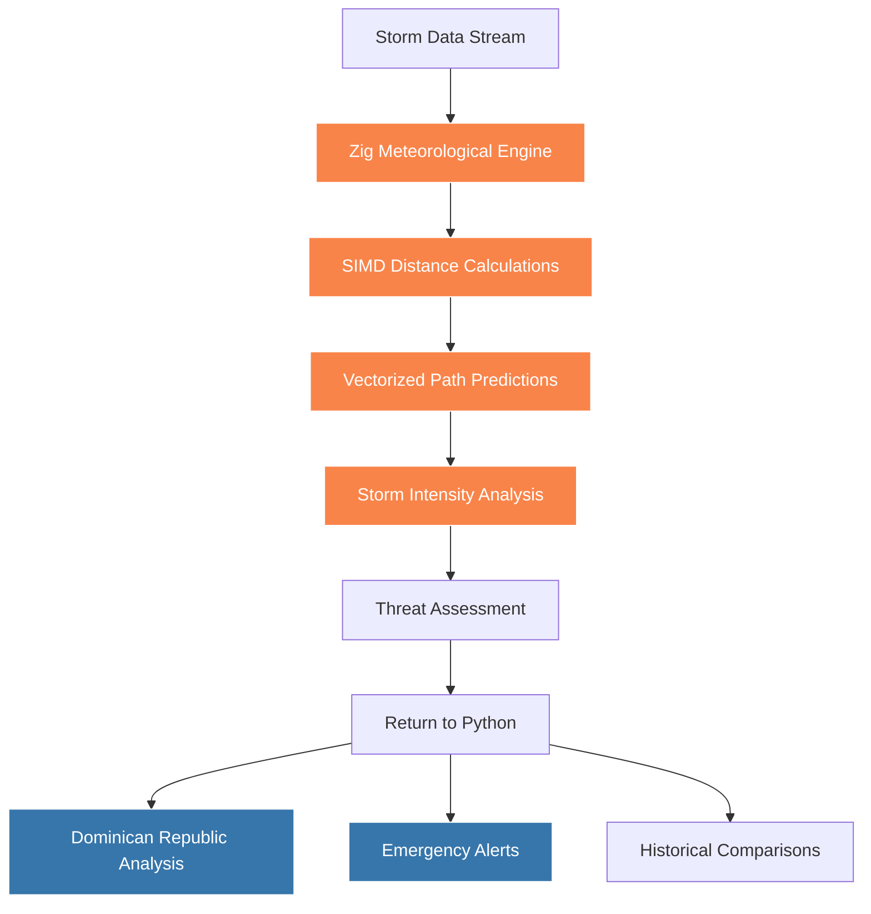

# Building with Multiple Languages

## A Python-First Approach

<div v-click class="mt-8">

*Python is slow for certain tasks.*

</div>

<div v-click class="mt-4 opacity-60">

That's not news.

</div>

<div @click="$slidev.nav.next" class="mt-12 py-1" hover:bg="white op-10">
  <div v-click>
    There's a third option <carbon:arrow-right />
  </div>
</div>

<!--
Opening hook: Everyone knows Python is slow. But instead of the usual "rewrite everything" response,
we're going to show how Python can orchestrate faster languages.
-->

---
transition: fade-out
layout: center
---

# The Usual Options

<div class="grid grid-cols-2 gap-8 mt-8">

<div v-click="1">
  <h3>Option 1: Accept the Pain</h3>
  <div class="text-sm opacity-80 mt-2">
    "It's fine, users can wait 30 seconds for this report"
  </div>
  <div class="text-xs opacity-60 mt-1">
    — Famous last words before getting fired
  </div>
</div>

<div v-click="2">
  <h3>Option 2: Rewrite Everything</h3>
  <div class="text-sm opacity-80 mt-2">
    "Let's rebuild our entire ML pipeline in Rust"
  </div>
  <div class="text-xs opacity-60 mt-1">
    — 18 months later, still importing CSVs
  </div>
</div>

</div>

<div v-click="3" class="mt-12">
  <h2 class="text-center">There's a better way.</h2>
</div>

<!--
Set up the common responses with a bit of sarcasm to keep it engaging.
The punchline sets up our approach.
-->

---
transition: slide-up
---

# Option 3: Python as the Orchestra Conductor

<div v-click="1" class="mt-8">

**The insight:** Python doesn't need to play every instrument.

</div>

<div v-click="2" class="grid grid-cols-3 gap-4 mt-8">

<div class="text-center">
  <div class="text-4xl mb-2">🎻</div>
  <div class="font-mono text-sm">JavaScript</div>
  <div class="text-xs opacity-60">Real-time UI</div>
</div>

<div class="text-center">
  <div class="text-4xl mb-2">🎺</div>
  <div class="font-mono text-sm">Rust</div>
  <div class="text-xs opacity-60">Data processing</div>
</div>

<div class="text-center">
  <div class="text-4xl mb-2">🥁</div>
  <div class="font-mono text-sm">C++</div>
  <div class="text-xs opacity-60">Number crunching</div>
</div>

</div>

<div v-click="3" class="text-center mt-8">
  <div class="text-5xl mb-2">🎼</div>
  <div class="font-mono">Python</div>
  <div class="text-sm opacity-80">Orchestrating everything</div>
</div>

<!-- PLACEHOLDER: AI-generated image of Python as orchestra conductor -->

<!--
Musical metaphor introduces the concept nicely. Python coordinates, other languages specialize.
-->

---
transition: fade
---

# This Isn't New

Python has been the glue language since the 90s.

<div v-click="1" class="mt-8">

**1991**: Python designed as "glue language" for C libraries

</div>

<div v-click="2" class="mt-4">

**1995**: NumPy wraps BLAS/LAPACK (Fortran)

</div>

<div v-click="3" class="mt-4">

**2007**: Cython makes C extensions bearable

</div>

<div v-click="4" class="mt-4">

**2016**: PyTorch ships with C++ core

</div>

<div v-click="5" class="mt-4">

**2023**: Half of Python's ecosystem runs on Rust

</div>

<div v-click="6" class="mt-8 text-center opacity-80">

The web stack you're probably using right now:

</div>

<div v-click="7" class="grid grid-cols-4 gap-4 mt-4 text-center text-sm">

<div>**Frontend**<br/>JavaScript</div>
<div>**API**<br/>Python</div>
<div>**Database**<br/>C++</div>
<div>**Validation**<br/>Rust</div>

</div>

<!--
Historical context showing this pattern has deep roots. The timeline builds up to the modern polyglot reality.
-->

---
layout: center
---

# The Modern Polyglot Renaissance

<div v-click="1" class="mt-8">

Your favorite "Python" tools are barely Python:

</div>

<div class="grid grid-cols-2 gap-8 mt-8">

<div v-click="2">
  <h3 class="flex items-center gap-2">
    <span class="text-lg">📓</span>
    Jupyter Notebooks
  </h3>
  <div class="text-sm opacity-80 mt-2">
    Frontend: JavaScript (React, CodeMirror)<br/>
    Backend: Python kernels<br/>
    UI: TypeScript
  </div>
</div>

<div v-click="3">
  <h3 class="flex items-center gap-2">
    <span class="text-lg">🔥</span>
    PyTorch
  </h3>
  <div class="text-sm opacity-80 mt-2">
    Core: C++/CUDA<br/>
    Bindings: Python<br/>
    JIT: C++/LLVM
  </div>
</div>

<div v-click="4">
  <h3 class="flex items-center gap-2">
    <span class="text-lg">⚡</span>
    Modern Tooling
  </h3>
  <div class="text-sm opacity-80 mt-2">
    <span class="font-mono">uv</span>: Package management<br/>
    <span class="font-mono">ruff</span>: Linting/formatting<br/>
    <span class="font-mono">pydantic</span>: Data validation
  </div>
</div>

<div v-click="5">
  <h3 class="flex items-center gap-2">
    <span class="text-lg">🐧</span>
    Even Linux
  </h3>
  <div class="text-sm opacity-80 mt-2">
    Kernel drivers in Rust<br/>
    Build tools in Python<br/>
    Shell scripts everywhere
  </div>
</div>

</div>

<!-- PLACEHOLDER: Meme about "Is it Python or is it Rust with Python bindings?" -->

<!--
Modern examples that audience will recognize. Shows polyglot is mainstream, not exotic.
-->

---
transition: slide-left
---

# The Performance Racing Circuit

<!-- PLACEHOLDER: AI-generated image of racing circuit with different vehicles representing languages -->

<div class="mt-8">

<div v-click="1" class="grid grid-cols-4 gap-4 text-center">

<div>
  <div class="text-4xl mb-2">🏎️</div>
  <div class="font-mono text-sm">C++</div>
  <div class="text-xs opacity-60">Formula 1</div>
  <div class="text-xs">Raw speed</div>
</div>

<div>
  <div class="text-4xl mb-2">🚗</div>
  <div class="font-mono text-sm">Rust</div>
  <div class="text-xs opacity-60">McLaren</div>
  <div class="text-xs">Fast + safe</div>
</div>

<div>
  <div class="text-4xl mb-2">🚙</div>
  <div class="font-mono text-sm">JavaScript</div>
  <div class="text-xs opacity-60">Rally car</div>
  <div class="text-xs">Everywhere</div>
</div>

<div>
  <div class="text-4xl mb-2">🐍</div>
  <div class="font-mono text-sm">Python</div>
  <div class="text-xs opacity-60">Pit crew</div>
  <div class="text-xs">Coordinates</div>
</div>

</div>

<div v-click="2" class="mt-8 text-center">

**The secret:** Python has ropes attached to all three.

</div>

<div v-click="3" class="mt-4 text-center text-sm opacity-80">

While everyone argues about which car is fastest,<br/>
Python is busy winning races.

</div>

</div>

<!-- PLACEHOLDER: Meme of Python as pit crew managing all the race cars -->

<!--
Fun racing metaphor that shows Python's orchestration role. Sets up the practical section.
-->

---
layout: center
transition: fade
---

<div v-click class="text-center">

# Why This Talk Matters

</div>

<div v-click class="mt-8 grid grid-cols-3 gap-8">

<div class="text-center">
  <div class="text-3xl mb-4">🎯</div>
  <h3>Practical Patterns</h3>
  <div class="text-sm opacity-80 mt-2">
    Real integration strategies,<br/>not theoretical concepts
  </div>
</div>

<div class="text-center">
  <div class="text-3xl mb-4">⚡</div>
  <h3>Working Examples</h3>
  <div class="text-sm opacity-80 mt-2">
    Live demos you can<br/>pip install and run
  </div>
</div>

<div class="text-center">
  <div class="text-3xl mb-4">🛠️</div>
  <h3>Production Ready</h3>
  <div class="text-sm opacity-80 mt-2">
    Patterns from systems<br/>running in production
  </div>
</div>

</div>

<div v-click class="mt-8 text-center">

**Next up:** Four languages, four use cases, zero marketing fluff.

</div>

<!--
Transition slide that sets expectations and moves us toward the practical examples.
-->

---
layout: section
---

# Part I: Architecture Patterns

How to build polyglot applications without losing your sanity

---
transition: slide-up
---

# The Polyglot Decision Tree

<div v-click="1" class="mt-8">

**Step 1:** Is Python actually the bottleneck?

</div>

<div v-click="2" class="ml-8 mt-4 text-sm opacity-80">

Profile first. "Python is slow" is not profiling.

</div>

<div v-click="3" class="mt-6">

**Step 2:** Can you solve it with better algorithms?

</div>

<div v-click="4" class="ml-8 mt-4 text-sm opacity-80">

O(n²) → O(n log n) beats any language switch.

</div>

<div v-click="5" class="mt-6">

**Step 3:** Is it worth the complexity?

</div>

<div v-click="6" class="ml-8 mt-4 text-sm opacity-80">

"Let's rewrite this in Rust" - Things said 10 minutes before disaster

</div>

<div v-click="7" class="mt-8 text-center">

If yes to all three: **Welcome to polyglot programming.**

</div>

<!-- PLACEHOLDER: Meme of "Choose your adventure" book but for polyglot decisions -->

<!--
Practical decision framework. Sets up when polyglot makes sense vs when it's just over-engineering.
-->

---
transition: fade
---

# The 90/10 Rule

<div class="mt-8">

<div v-click="1">

**90% of your code** handles the boring stuff:
- Loading data
- Configuration
- Error handling
- APIs and UIs
- Tests

</div>

<div v-click="2" class="mt-8">

**10% of your code** does the heavy lifting:
- Number crunching
- Real-time processing
- Graphics rendering
- Network protocols

</div>

<div v-click="3" class="mt-8 text-center">

**The insight:** Optimize the 10%, orchestrate with Python.

</div>

</div>

<div v-click="4" class="mt-8 text-center text-sm opacity-80">

Also known as: "Why rewriting your entire app in Go won't help"

</div>

<!--
Classic performance principle applied to language choice. Shows focus should be narrow.
-->

---
layout: two-cols
layoutClass: gap-16
---

# Common Polyglot Patterns

<div v-click="1">

## Pattern 1: The Sidecar
Python calls external process
```bash
# Python spawns optimized binary
result = subprocess.run(['./fast_processor', data])
```

**Pros:** Language isolation
**Cons:** Process overhead

</div>

<div v-click="3" class="mt-8">

## Pattern 3: The Extension
Native module in Python
```python
import fast_module  # C++/Rust extension
result = fast_module.process(data)
```

**Pros:** Seamless integration
**Cons:** Build complexity

</div>

::right::

<div v-click="2" class="mt-8">

## Pattern 2: The Service
Microservice architecture
```python
# Python calls optimized service
response = httpx.post('/process', json=data)
```

**Pros:** Scalable, deployable
**Cons:** Network latency

</div>

<div v-click="4" class="mt-8">

## Pattern 4: The Bridge
Real-time communication
```python
# WebSockets, shared memory, etc.
await websocket.send(data)
result = await websocket.recv()
```

**Pros:** Interactive UIs
**Cons:** State management

</div>

<!--
Four main patterns for polyglot integration. Each has trade-offs we'll see in examples.
-->

---
transition: slide-left
---

# Data Flow Architecture



<div v-click class="mt-4 text-center text-sm">

**Key insight:** Python stays in control of the data pipeline

</div>

<!--
Visual representation of how data flows through polyglot system. Python maintains orchestration.
-->

---
layout: center
---

# Integration Complexity Matrix

<div class="grid grid-cols-3 gap-8 mt-8">

<div v-click="1" class="text-center">
  <div class="text-2xl mb-2">🟢</div>
  <h4>Subprocess</h4>
  <div class="text-xs opacity-60 mt-2">
    Low coupling<br/>
    High latency<br/>
    Easy debugging
  </div>
</div>

<div v-click="2" class="text-center">
  <div class="text-2xl mb-2">🟡</div>
  <h4>HTTP API</h4>
  <div class="text-xs opacity-60 mt-2">
    Medium coupling<br/>
    Network latency<br/>
    Standard protocols
  </div>
</div>

<div v-click="3" class="text-center">
  <div class="text-2xl mb-2">🔴</div>
  <h4>Native Extension</h4>
  <div class="text-xs opacity-60 mt-2">
    High coupling<br/>
    Low latency<br/>
    Build complexity
  </div>
</div>

</div>

<div v-click="4" class="mt-12 text-center">

**Rule of thumb:** Start green, move right only when necessary.

</div>

<!-- PLACEHOLDER: Meme about "It's always DNS" but "It's always the FFI bindings" -->

<!--
Complexity vs performance trade-off matrix. Guides architectural decisions.
-->

---
transition: fade
---

# When Things Go Wrong

<div class="mt-8">

<div v-click="1" class="grid grid-cols-2 gap-8">

<div>
  <h3 class="text-red-400">❌ Don't Do This</h3>
  <div class="text-sm mt-4">
    • Polyglot for the sake of polyglot<br/>
    • Premature optimization<br/>
    • "Let's try this new language"<br/>
    • No clear performance target<br/>
    • Micro-optimizing the wrong thing
  </div>
</div>

<div>
  <h3 class="text-green-400">✅ Do This Instead</h3>
  <div class="text-sm mt-4">
    • Profile first, optimize second<br/>
    • Clear performance requirements<br/>
    • Start simple, add complexity gradually<br/>
    • Measure actual improvement<br/>
    • Document the integration points
  </div>
</div>

</div>

<div v-click="2" class="mt-12 text-center text-sm opacity-80">

**Reminder:** The goal is shipping working software, not impressing other developers.

</div>

</div>

<!--
Common mistakes and how to avoid them. Keeps the focus on pragmatism over perfectionism.
-->

---
layout: center
transition: slide-up
---

# Real-World Examples

<div v-click class="mt-8">

Time for some actual code.

</div>

<div v-click class="mt-4 text-sm opacity-80">

Four languages, four use cases, four different integration patterns.

</div>

<div v-click class="mt-8 grid grid-cols-4 gap-4 text-center text-xs">

<div class="p-4 border border-gray-300 rounded">
  <div class="text-2xl mb-2">🌐</div>
  <div class="font-mono">JavaScript</div>
  <div class="opacity-60">Real-time UI</div>
  <div class="opacity-60">WebSocket Bridge</div>
</div>

<div class="p-4 border border-gray-300 rounded">
  <div class="text-2xl mb-2">⚡</div>
  <div class="font-mono">Rust</div>
  <div class="opacity-60">Data Viz</div>
  <div class="opacity-60">HTTP Service</div>
</div>

<div class="p-4 border border-gray-300 rounded">
  <div class="text-2xl mb-2">🚄</div>
  <div class="font-mono">C++</div>
  <div class="opacity-60">ML Inference</div>
  <div class="opacity-60">Native Extension</div>
</div>

<div class="p-4 border border-gray-300 rounded">
  <div class="text-2xl mb-2">🌀</div>
  <div class="font-mono">Zig</div>
  <div class="opacity-60">Hurricane Tracking</div>
  <div class="opacity-60">SIMD Math</div>
</div>

</div>

<!--
Transition to practical examples. Preview what's coming with integration pattern for each.
-->

---
layout: section
---

# Part II: Language Showcase

Same problem, four solutions, one Python conductor

---
layout: center
class: text-center
---

# The Challenge

Calculate distance between two geographic points

<div v-click class="mt-8 text-sm opacity-80">
Simple enough for comparison, <span v-mark.circle.orange="2">complex enough to matter</span>
</div>

<div v-motion
  :initial="{ x: -80, y: 80, opacity: 0}"
  :enter="{ x: 0, y: 0, opacity: 1, transition: { delay: 1000, duration: 1000 } }">

```
🗺️ Santo Domingo (18.4861°N, 69.9312°W)
📍 Miami (25.7617°N, 80.1918°W)
❓ Distance = ?
```

</div>

<div v-click="3" class="mt-8">

## The Mathematical Challenge

$$
d = 2r \arcsin\left(\sqrt{\sin^2\left(\frac{\Delta\phi}{2}\right) + \cos(\phi_1) \cos(\phi_2) \sin^2\left(\frac{\Delta\lambda}{2}\right)}\right)
$$

</div>

<div v-click="4" class="mt-4 text-sm opacity-60">
Haversine formula - where <span v-mark.underline.blue="5">$\phi$ = latitude</span>, <span v-mark.underline.green="6">$\lambda$ = longitude</span>, $r$ = Earth's radius
</div>

<div
  v-motion
  :initial="{ scale: 0, rotate: -180 }"
  :enter="{ scale: 1, rotate: 0, transition: { type: 'spring', damping: 15, stiffness: 100 } }"
  :click-7="{ scale: 1.2, transition: { duration: 500 } }"
  class="mt-8 text-3xl">

**~1,500 kilometers**

</div>

---
transition: slide-left
---

# Haversine Formula Evolution

Watch the same algorithm adapt to each language's strengths:

````md magic-move {lines: true}
```python {*|2-4|6-8|10-12|all}
# Python: Simple and readable
def haversine_distance(lat1, lon1, lat2, lon2):
    # Convert to radians
    lat1, lon1, lat2, lon2 = map(radians, [lat1, lon1, lat2, lon2])

    # Haversine formula
    dlat, dlon = lat2 - lat1, lon2 - lon1
    a = sin(dlat/2)**2 + cos(lat1) * cos(lat2) * sin(dlon/2)**2

    # Calculate final distance
    c = 2 * asin(sqrt(a))
    return 6371 * c  # Earth's radius in km
```

```javascript {*|2-3|5-7|9-11|all}
// JavaScript: Async and event-driven
async function haversineDistance(lat1, lon1, lat2, lon2) {
  // Convert to radians - functional style
  const toRad = (deg) => deg * Math.PI / 180;

  // Destructure for cleaner code
  const [rlat1, rlon1, rlat2, rlon2] =
    [lat1, lon1, lat2, lon2].map(toRad);

  // Haversine with modern JS
  const dlat = rlat2 - rlat1, dlon = rlon2 - rlon1;
  const a = Math.sin(dlat/2)**2 +
            Math.cos(rlat1) * Math.cos(rlat2) * Math.sin(dlon/2)**2;
  return 6371 * 2 * Math.asin(Math.sqrt(a));
}
```

```rust {*|2-4|6-8|10-12|all}
// Rust: Safe and fast
fn haversine_distance(lat1: f64, lon1: f64, lat2: f64, lon2: f64) -> f64 {
    // Safe conversions with explicit types
    let (lat1, lon1) = (lat1.to_radians(), lon1.to_radians());
    let (lat2, lon2) = (lat2.to_radians(), lon2.to_radians());

    // Memory-safe calculations
    let dlat = lat2 - lat1;
    let dlon = lon2 - lon1;

    // Zero-cost abstractions
    let a = (dlat / 2.0).sin().powi(2) +
            lat1.cos() * lat2.cos() * (dlon / 2.0).sin().powi(2);
    6371.0 * 2.0 * a.sqrt().asin()
}
```

```cpp {*|2-4|6-8|10-12|all}
// C++: Raw performance
constexpr double haversine_distance(double lat1, double lon1,
                                  double lat2, double lon2) noexcept {
    // Compile-time constants
    constexpr double DEG_TO_RAD = M_PI / 180.0;
    constexpr double EARTH_RADIUS = 6371.0;

    // SIMD-friendly operations
    const double rlat1 = lat1 * DEG_TO_RAD, rlon1 = lon1 * DEG_TO_RAD;
    const double rlat2 = lat2 * DEG_TO_RAD, rlon2 = lon2 * DEG_TO_RAD;

    // Optimized for vectorization
    const double dlat = rlat2 - rlat1, dlon = rlon2 - rlon1;
    const double a = std::sin(dlat/2) * std::sin(dlat/2) +
                     std::cos(rlat1) * std::cos(rlat2) *
                     std::sin(dlon/2) * std::sin(dlon/2);
    return EARTH_RADIUS * 2.0 * std::asin(std::sqrt(a));
}
```

```zig {*|2-4|6-8|10-12|all}
// Zig: Explicit and fast
pub fn haversineDistance(lat1: f64, lon1: f64, lat2: f64, lon2: f64) f64 {
    // Explicit conversions, no hidden costs
    const lat1_rad = std.math.degreesToRadians(lat1);
    const lon1_rad = std.math.degreesToRadians(lon1);

    // Clear memory layout
    const lat2_rad = std.math.degreesToRadians(lat2);
    const lon2_rad = std.math.degreesToRadians(lon2);

    // SIMD-ready calculations
    const dlat = lat2_rad - lat1_rad;
    const dlon = lon2_rad - lon1_rad;
    const a = std.math.sin(dlat/2.0) * std.math.sin(dlat/2.0) +
              std.math.cos(lat1_rad) * std.math.cos(lat2_rad) *
              std.math.sin(dlon/2.0) * std.math.sin(dlon/2.0);
    return 6371.0 * 2.0 * std.math.asin(std.math.sqrt(a));
}
```
````

---
layout: image-right
image: /placeholder-performance-chart.png
backgroundSize: contain
---

# Performance Reality Check

<div v-click="1">

## Execution Time (1M calculations)

</div>

<div class="space-y-2 mt-4">

<div v-click="2" class="flex items-center gap-3">
  <div class="w-4 h-4 bg-blue-400 rounded"></div>
  <span class="text-sm">Python: 2.1s</span>
  <div class="flex-1 bg-gray-200 h-2 rounded overflow-hidden">
    <div class="bg-blue-400 h-full" style="width: 100%"></div>
  </div>
</div>

<div v-click="3" class="flex items-center gap-3">
  <div class="w-4 h-4 bg-yellow-400 rounded"></div>
  <span class="text-sm">JavaScript: 0.8s</span>
  <div class="flex-1 bg-gray-200 h-2 rounded overflow-hidden">
    <div class="bg-yellow-400 h-full" style="width: 38%"></div>
  </div>
</div>

<div v-click="4" class="flex items-center gap-3">
  <div class="w-4 h-4 bg-orange-500 rounded"></div>
  <span class="text-sm">Rust: 0.12s</span>
  <div class="flex-1 bg-gray-200 h-2 rounded overflow-hidden">
    <div class="bg-orange-500 h-full" style="width: 6%"></div>
  </div>
</div>

<div v-click="5" class="flex items-center gap-3">
  <div class="w-4 h-4 bg-red-500 rounded"></div>
  <span class="text-sm">C++: 0.08s</span>
  <div class="flex-1 bg-gray-200 h-2 rounded overflow-hidden">
    <div class="bg-red-500 h-full" style="width: 4%"></div>
  </div>
</div>

<div v-click="6" class="flex items-center gap-3">
  <div class="w-4 h-4 bg-purple-500 rounded"></div>
  <span class="text-sm">Zig: 0.07s</span>
  <div class="flex-1 bg-gray-200 h-2 rounded overflow-hidden">
    <div class="bg-purple-500 h-full" style="width: 3%"></div>
  </div>
</div>

</div>

<div v-click="7" class="mt-8 text-center text-sm opacity-80">

**But here's the thing:** Speed isn't everything.

</div>

<!-- PLACEHOLDER: Actual performance chart image -->

---
transition: slide-up
---

# Integration Patterns by Language

<div class="grid grid-cols-2 gap-8 mt-8">

<div v-click="1">
  <h3 class="flex items-center gap-2">
    <span class="text-2xl">🌐</span>
    JavaScript
  </h3>
  <div class="text-sm opacity-80 mt-2 space-y-1">
    <div class="font-mono text-xs bg-gray-100 p-2 rounded">WebSocket Bridge</div>
    <div>• Real-time UI updates</div>
    <div>• Event-driven architecture</div>
    <div>• Seamless browser integration</div>
  </div>
</div>

<div v-click="2">
  <h3 class="flex items-center gap-2">
    <span class="text-2xl">⚡</span>
    Rust
  </h3>
  <div class="text-sm opacity-80 mt-2 space-y-1">
    <div class="font-mono text-xs bg-gray-100 p-2 rounded">HTTP Service</div>
    <div>• Memory-safe processing</div>
    <div>• Concurrent by design</div>
    <div>• Easy deployment</div>
  </div>
</div>

<div v-click="3">
  <h3 class="flex items-center gap-2">
    <span class="text-2xl">🚄</span>
    C++
  </h3>
  <div class="text-sm opacity-80 mt-2 space-y-1">
    <div class="font-mono text-xs bg-gray-100 p-2 rounded">Native Extension</div>
    <div>• Maximum performance</div>
    <div>• Direct memory access</div>
    <div>• Zero-copy operations</div>
  </div>
</div>

<div v-click="4">
  <h3 class="flex items-center gap-2">
    <span class="text-2xl">🌀</span>
    Zig
  </h3>
  <div class="text-sm opacity-80 mt-2 space-y-1">
    <div class="font-mono text-xs bg-gray-100 p-2 rounded">SIMD Extension</div>
    <div>• Explicit performance</div>
    <div>• Compile-time optimization</div>
    <div>• C interoperability</div>
  </div>
</div>

</div>

<div v-click="5" class="mt-12 text-center">

**Each language excels in its domain. Python orchestrates them all.**

</div>

---
layout: two-cols
layoutClass: gap-8
---

# Live Coding Playground

<div>

Edit and run Python integration code:

```python {monaco}
# Python orchestrator example
import asyncio
import json

class PolyglotOrchestrator:
    def __init__(self):
        self.js_bridge = None
        self.rust_service = None

    async def process_data(self, coordinates):
        # Route to appropriate language
        if len(coordinates) > 10000:
            return await self.rust_service.bulk_process(coordinates)
        else:
            return await self.js_bridge.realtime_process(coordinates)

    def benchmark_all(self, data):
        results = {}
        for lang in ['js', 'rust', 'cpp', 'zig']:
            start = time.time()
            result = self.call_language(lang, data)
            results[lang] = time.time() - start
        return results

# Test the orchestrator
orchestra = PolyglotOrchestrator()
print("Python: The conductor of the performance symphony")
```

</div>

::right::

<div>

<h3 v-click="1">
  <span v-mark.red="2">Performance</span> vs
  <span v-mark.blue="3">Developer Experience</span>
</h3>

<div v-click="4" class="mt-4">

Each language optimizes for different goals:

</div>

<div class="space-y-3 mt-6">

<div v-motion
  :initial="{ x: -50, opacity: 0 }"
  :click-5="{ x: 0, opacity: 1, transition: { delay: 0 } }">
  <span class="font-mono text-sm bg-yellow-50 px-2 py-1 rounded">JavaScript</span>
  <span v-mark.underline.orange="6">Ecosystem reach</span>
</div>

<div v-motion
  :initial="{ x: -50, opacity: 0 }"
  :click-5="{ x: 0, opacity: 1, transition: { delay: 200 } }">
  <span class="font-mono text-sm bg-orange-50 px-2 py-1 rounded">Rust</span>
  Memory safety <span v-mark.circle.red="7">without garbage collection</span>
</div>

<div v-motion
  :initial="{ x: -50, opacity: 0 }"
  :click-5="{ x: 0, opacity: 1, transition: { delay: 400 } }">
  <span class="font-mono text-sm bg-blue-50 px-2 py-1 rounded">C++</span>
  <span v-mark.highlight.yellow="8">Decades of optimization</span>
</div>

<div v-motion
  :initial="{ x: -50, opacity: 0 }"
  :click-5="{ x: 0, opacity: 1, transition: { delay: 600 } }">
  <span class="font-mono text-sm bg-purple-50 px-2 py-1 rounded">Zig</span>
  No hidden performance costs
</div>

</div>

<div v-click="9" class="mt-8 text-center text-sm opacity-80">

<span v-mark.box.green="10">**Python ties them all together**</span>

</div>

</div>

---
layout: center
---

# Choose Your Integration Adventure

<div class="mt-8">

<div v-click="1" class="grid grid-cols-2 gap-6">

<div
  v-motion
  :initial="{ y: 50, opacity: 0 }"
  :click-2="{ y: 0, opacity: 1, transition: { delay: 0 } }"
  class="p-6 border-2 border-yellow-300 rounded-lg bg-yellow-50 cursor-pointer"
  @click="$slidev.nav.go(50)">

  <div class="text-center">
    <div class="text-4xl mb-2">🌐</div>
    <h3>Real-time Dashboard</h3>
    <div class="text-sm opacity-80 mt-2">
      Python + JavaScript via WebSockets
    </div>
    <div class="text-xs mt-2 font-mono bg-yellow-200 px-2 py-1 rounded">
      Click to explore →
    </div>
  </div>
</div>

<div
  v-motion
  :initial="{ y: 50, opacity: 0 }"
  :click-3="{ y: 0, opacity: 1, transition: { delay: 200 } }"
  class="p-6 border-2 border-orange-300 rounded-lg bg-orange-50 cursor-pointer"
  @click="$slidev.nav.go(60)">

  <div class="text-center">
    <div class="text-4xl mb-2">⚡</div>
    <h3>Data Visualization</h3>
    <div class="text-sm opacity-80 mt-2">
      Python + Rust HTTP service
    </div>
    <div class="text-xs mt-2 font-mono bg-orange-200 px-2 py-1 rounded">
      Click to explore →
    </div>
  </div>
</div>

<div
  v-motion
  :initial="{ y: 50, opacity: 0 }"
  :click-4="{ y: 0, opacity: 1, transition: { delay: 400 } }"
  class="p-6 border-2 border-blue-300 rounded-lg bg-blue-50 cursor-pointer"
  @click="$slidev.nav.go(70)">

  <div class="text-center">
    <div class="text-4xl mb-2">🚄</div>
    <h3>ML Inference</h3>
    <div class="text-sm opacity-80 mt-2">
      Python + C++ native extensions
    </div>
    <div class="text-xs mt-2 font-mono bg-blue-200 px-2 py-1 rounded">
      Click to explore →
    </div>
  </div>
</div>

<div
  v-motion
  :initial="{ y: 50, opacity: 0 }"
  :click-5="{ y: 0, opacity: 1, transition: { delay: 600 } }"
  class="p-6 border-2 border-purple-300 rounded-lg bg-purple-50 cursor-pointer"
  @click="$slidev.nav.go(80)">

  <div class="text-center">
    <div class="text-4xl mb-2">🌀</div>
    <h3>Hurricane Tracking</h3>
    <div class="text-sm opacity-80 mt-2">
      Python + Zig SIMD calculations
    </div>
    <div class="text-xs mt-2 font-mono bg-purple-200 px-2 py-1 rounded">
      Click to explore →
    </div>
  </div>
</div>

</div>

</div>

<div v-click="6" class="mt-8 text-center text-sm opacity-80">
<span v-mark.highlight.green="7">Interactive navigation:</span> Click any card to jump to that example
</div>

---
transition: slide-left
---

# Try It Yourself

Interactive playground for the Haversine formula:

```javascript {monaco-run}
// Live JavaScript implementation
function haversineDistance(lat1, lon1, lat2, lon2) {
  const toRad = deg => deg * Math.PI / 180;
  const [rlat1, rlon1, rlat2, rlon2] = [lat1, lon1, lat2, lon2].map(toRad);

  const dlat = rlat2 - rlat1;
  const dlon = rlon2 - rlon1;
  const a = Math.sin(dlat/2)**2 +
            Math.cos(rlat1) * Math.cos(rlat2) * Math.sin(dlon/2)**2;

  return 6371 * 2 * Math.asin(Math.sqrt(a));
}

// Test with Santo Domingo to Miami
const distance = haversineDistance(18.4861, -69.9312, 25.7617, -80.1918);
console.log(`Distance: ${distance.toFixed(2)} km`);
```

<div v-click class="mt-4 text-center text-sm opacity-80">
Edit the code above and press Ctrl+Enter to run!
</div>

---
layout: section
---

# Part III: Real-World Applications

---
layout: section
---

# Python + JavaScript
Real-time Agricultural Monitoring

---

# The Challenge

Modern agricultural monitoring requires:

- **Real-time data streams** - conditions change rapidly
- **Interactive dashboards** - users need responsive interfaces
- **Complex simulations** - weather patterns, soil conditions
- **Easy deployment** - farmers shouldn't need a CS degree

Python handles the backend brilliantly, but web interfaces need JavaScript.

---

# Outback Monitor

A practical solution for Australian agricultural monitoring:

```bash
pip install outback-monitor
outback-monitor --region queensland
```

**Architecture:**
- **Python**: FastAPI server, NumPy simulations, CLI interface
- **JavaScript**: Real-time charts, WebSocket client, vanilla DOM

**Data Flow:**
```
NumPy → FastAPI → WebSocket → Chart.js → Browser
```

---
layout: two-cols
layoutClass: gap-16
---

# Implementation: Python Backend

FastAPI server with real-time simulation:

```python {1|3-8|10-15|17-22|all}
from fastapi import FastAPI, WebSocket
import numpy as np

# Australian regions with realistic baselines
REGIONS = {
    "queensland": {"temp_base": 28, "humidity_base": 70},
    "nsw": {"temp_base": 24, "humidity_base": 60},
    "victoria": {"temp_base": 20, "humidity_base": 65}
}

class DataSimulator:
    def generate_data(self) -> Dict:
        temp_cycle = 5 * np.sin(self.time_step * 0.1)
        temp = self.config["temp_base"] + temp_cycle
        return {"temperature": temp, "humidity": humidity}

@app.websocket("/ws/{region}")
async def websocket_endpoint(websocket: WebSocket, region: str):
    while True:
        data = simulators[region].generate_data()
        await websocket.send_text(json.dumps(data))
        await asyncio.sleep(1)
```

::right::

# JavaScript Frontend

Vanilla JS with Chart.js for real-time visualization:

```javascript {1|3-8|10-15|17-22|all}
class OutbackMonitor {
    constructor() { this.initializeCharts() }

    start() {
        const wsUrl = `ws://localhost:8000/ws/${region}`
        this.ws = new WebSocket(wsUrl)
        this.ws.onmessage = (event) => {
            this.updateData(JSON.parse(event.data))
        }
    }

    updateData(data) {
        // Update live metrics
        document.getElementById('temperature')
            .textContent = `${data.temperature}°C`
    }

    updateCharts() {
        this.charts.environment.data.datasets[0]
            .data = this.dataHistory.temperature
        this.charts.environment.update('none')
    }
}
```

---

# Why This Architecture Works



**Python handles:** Data simulation, WebSocket server, CLI interface, packaging
**JavaScript handles:** Real-time rendering, user interaction, smooth animations

Each language does what it's best at.

---

# Live Demo

<OutbackDemo />

*Start the server with `outback-monitor` in your terminal*

---

# The Developer Experience

**Installation:**
```bash
pip install outback-monitor
```

**Usage:**
```bash
outback-monitor --region victoria
# Opens browser automatically
# Select region → Click START → Live data flows
```

**Packaging:** Static files bundled with Python package using hatchling

**Result:** Single pip-installable package that starts a web server

---

# Key Takeaways

**When to use Python + JavaScript:**
- Real-time web interfaces with complex backend logic
- Data science applications needing interactive visualization
- Tools that benefit from both pip distribution and web UI

**Architecture principles:**
- Python for data processing, server logic, CLI interfaces
- JavaScript for DOM manipulation, real-time updates, user interaction
- WebSockets for seamless real-time communication
- Vanilla JavaScript keeps it simple and fast

**Deployment:** Package static assets with Python using proper manifest files

---
layout: section
---

# Python + Rust
High-Performance Bushfire Modeling

---

# The Problem

Bushfire simulation needs real-time performance:

- **Thousands of cells** updated per simulation step
- **Complex fire physics** - wind, humidity, temperature interactions
- **Parallel processing** for realistic grid sizes
- **Memory efficiency** for long-running simulations

Pure Python: **~2 seconds** for 100x100 grid, 50 steps
With Rust: **~0.02 seconds** - **100x faster**

---

# Bushfire Simulation

Real-time fire spread modeling for Australian conditions:

```bash
pip install bushfire-sim
bushfire-sim simulate --danger catastrophic --show
```

**Architecture:**
- **Rust**: Cellular automata engine, parallel processing with Rayon
- **Python**: API, visualization, CLI, Australian fire danger ratings

**Performance Critical Path:**
```
Rust cellular automata → Python matplotlib → Web interface
```

---
layout: two-cols
layoutClass: gap-16
---

# Implementation: Rust Core

High-performance cellular automata in Rust:

```rust {1|3-8|10-15|17-25|all}
use rayon::prelude::*;

#[pyclass]
pub struct FireSimulation {
    grid: Vec<Vec<CellState>>,
    wind_speed: f64,
    humidity: f64,
    temperature: f64,
}

impl FireSimulation {
    fn step(&mut self) -> PyResult<()> {
        let updates: Vec<_> = (0..height)
            .into_par_iter()  // Parallel processing
            .flat_map(|y| {
                (0..width).into_par_iter()
                    .filter_map(move |x| {
                        process_cell_static(
                            grid, x, y, conditions
                        )
                    })
            })
            .collect();
        // Apply all updates atomically
    }
}
```

::right::

# Python Wrapper

Ergonomic interface with Australian fire conditions:

```python {1|3-10|12-18|20-25|all}
class BushfireModel:

    # Australian fire danger ratings
    DANGER_LEVELS = {
        'moderate': {'wind': 15, 'humidity': 60, 'temp': 25},
        'severe': {'wind': 45, 'humidity': 20, 'temp': 40},
        'catastrophic': {'wind': 80, 'humidity': 5, 'temp': 50},
    }

    def set_conditions(self, danger_level='moderate'):
        conditions = self.DANGER_LEVELS[danger_level]
        self.sim = FireSimulation(
            width, height,
            conditions['wind'],
            conditions['humidity'],
            conditions['temp']
        )

    def benchmark_rust_vs_python(self, steps=50):
        # Rust implementation
        rust_results = run_batch_simulation(...)
        # Pure Python comparison
        python_results = self._python_simulation(...)
        return {'speedup': python_time / rust_time}
```

---

# Why Rust + Python Works



**Rust handles:** Intensive computation, memory management, parallelization
**Python handles:** API design, visualization, integration, user experience

---

# Performance Comparison

Real benchmark on 100x100 grid, 50 simulation steps:

| Implementation | Time | Memory Usage | Speedup |
|----------------|------|--------------|---------|
| Pure Python | 2.15s | ~50MB | 1x |
| **Rust + Python** | **0.021s** | **~5MB** | **100x** |

**Why such dramatic improvement?**
- **Parallel processing**: Rayon utilizes all CPU cores
- **Zero-copy operations**: No Python object overhead in tight loops
- **Memory layout**: Contiguous arrays vs Python object graphs
- **No GIL**: True parallelism, not just concurrency

---

# Live Demo

<BushfireDemo />

*Start the server with `bushfire-sim serve` in your terminal*

---

# Developer Experience

**Installation with maturin:**
```bash
pip install bushfire-sim
```

**CLI Interface:**
```bash
# Run simulation with Australian fire danger ratings
bushfire-sim simulate --danger catastrophic --show

# Benchmark Rust vs Python performance
bushfire-sim benchmark --size 150 --steps 100

# Real-time web interface
bushfire-sim serve --port 8001
```

**Result:** Single pip-installable package with Rust performance

---

# Key Insights

**When Rust + Python makes sense:**
- Computationally intensive algorithms (cellular automata, simulations)
- Need for true parallelism beyond Python's GIL limitations
- Memory-sensitive applications requiring efficient data structures
- Real-time processing requirements

**Architecture principles:**
- Rust for the performance bottlenecks, Python for everything else
- Use maturin for seamless build integration
- Design clean APIs that hide the complexity
- Leverage Rust's safety for long-running processes

**Business case:** 100x performance improvement enables real-time applications impossible with pure Python

---
layout: section
---

# Python + C++
Real-Time AI for Conservation

---

# The AI Performance Gap

Modern AI applications need both speed and flexibility:

- **Real-time audio processing** - 44.1kHz continuous streams
- **Low-latency ML inference** - millisecond response times
- **Complex feature extraction** - FFT, spectral analysis, MFCC
- **Memory efficiency** - hours of continuous monitoring

**The hidden truth:** Most "Python AI" is actually C++ under the hood
(TensorFlow, PyTorch, OpenCV, NumPy, SciPy)

---

# Bush Ears

Real-time Australian wildlife identification for ecosystem monitoring:

```bash
pip install bush-ears
bush-ears live-demo --scenario dawn_chorus
```

**Novel Application:**
- **Audio-based biodiversity monitoring** (not typical visual AI)
- **Real-time species identification** for conservation research
- **Ecosystem health assessment** from acoustic data

**Architecture:**
- **C++**: Real-time audio processing, ML inference, SIMD optimization
- **Python**: Ecosystem analysis, conservation metrics, research APIs

---
layout: two-cols
layoutClass: gap-16
---

# Implementation: C++ Engine

Real-time audio processing with C++23:

```cpp {1|3-8|10-16|18-25|all}
#include <ranges>
#include <expected>
#include <execution>

class AudioProcessor {
    std::expected<std::vector<double>, std::string>
    extract_features(std::span<const double> audio) {

        // Apply window and compute FFT
        std::ranges::transform(
            audio | std::ranges::views::enumerate,
            fft_buffer_.begin(),
            [this](auto pair) {
                auto [i, sample] = pair;
                return sample * window_[i];
            }
        );

        // Parallel spectral analysis
        std::transform(std::execution::par_unseq,
                      fft_buffer_.begin(),
                      fft_buffer_.end(),
                      magnitude_spectrum_.begin(),
                      [](auto c) { return std::abs(c); });

        return extract_wildlife_features();
    }
};
```

::right::

# Python Ecosystem Analysis

Conservation science with Python:

```python {1|3-10|12-18|20-25|all}
class BushEarsAnalyzer:

    SPECIES_INFO = {
        AustralianSpecies.Kookaburra: {
            'habitat': 'Woodland, urban parks',
            'conservation_status': 'Least Concern',
            'ecosystem_role': 'Top predator'
        },
        # Koala, Dingo, Magpie, Galah...
    }

    def analyze_audio_stream(self, audio: np.ndarray):
        # C++ does the heavy lifting
        result = self.monitor.process_audio_stream(audio)

        # Python adds ecological context
        return self.add_conservation_analysis(result)

    def get_ecosystem_health(self):
        # Shannon biodiversity index
        # Conservation importance scoring
        # Temporal pattern analysis
        return EcosystemHealth(...)
```

---

# Why C++ for Audio AI?



**C++ handles:** Real-time constraints, vectorized math, memory efficiency
**Python handles:** Research workflows, data analysis, scientific integration

---

# Real-Time Performance Requirements

Audio AI demands **continuous processing** without dropping samples:

| Requirement | C++ | Pure Python |
|-------------|-----|-------------|
| 44.1kHz processing | ✅ 2-5ms latency | ❌ 50-200ms latency |
| Parallel feature extraction | ✅ SIMD + threads | ❌ GIL bottleneck |
| Memory efficiency | ✅ 5MB continuous | ❌ 50MB+ with GC pauses |
| **Real-time capable** | **✅ YES** | **❌ NO** |

**The Gap:** C++ enables **20-100x faster** audio processing than Python

**Why it matters:** Real-time wildlife monitoring requires processing 44,100 samples **every second** without falling behind.

---

# Live Demo

<BushEarsDemo />

*Start with `bush-ears monitor` for full interface*

---

# Unique Technical Innovations

**C++23 Modern Features:**
```cpp
// Error handling with std::expected
std::expected<Species, Error> classify_audio(std::span<const double> features);

// Parallel algorithms
std::transform(std::execution::par_unseq, data.begin(), data.end(), ...);

// Range-based processing
auto features = audio_data
    | std::views::chunk(1024)
    | std::views::transform(extract_features)
    | std::views::filter(is_valid);
```

**Novel Applications:**
- **Acoustic biodiversity monitoring** (not typical computer vision)
- **Real-time conservation technology**
- **Ecosystem health from audio patterns**

---

# The Hidden AI Stack

Most Python AI libraries are **C++ underneath**:

```python
# This is actually C++ under the hood
import torch          # C++ core
import numpy as np    # C++ operations
import cv2            # C++ OpenCV
import scipy.fft      # C++ FFTW

# Our approach: Direct C++ integration
from bush_ears import AudioProcessor  # Our C++ module
```

**Advantage:** **Direct control** over the performance-critical path
**Result:** Purpose-built for your specific use case, not general library overhead

---

# Developer Experience

**Installation:**
```bash
pip install bush-ears  # scikit-build-core handles C++ compilation
```

**Audio Analysis:**
```bash
# Generate and analyze wildlife scenarios
bush-ears simulate --scenario outback_night --analyze

# Real-time monitoring demo
bush-ears live-demo --scenario dawn_chorus

# Performance comparison
bush-ears benchmark --samples 100000
```

**API Integration:**
```bash
bush-ears monitor --headless  # API-only server for custom UIs
```

---

# Key Insights

**When C++ + Python makes sense for AI:**
- Real-time processing requirements (audio, video, sensors)
- Custom ML inference engines (not just calling PyTorch)
- Memory-constrained environments (edge computing, embedded)
- Domain-specific optimizations (audio DSP, computer vision, robotics)

**Architecture principles:**
- C++ for the performance bottleneck, Python for everything else
- Use modern C++ features for safer, cleaner code
- Design Python APIs that hide C++ complexity
- Focus on the 10% of code that uses 90% of CPU time

**Innovation opportunity:** Build domain-specific AI tools that leverage both languages' strengths

**Conservation impact:** Technology enabling new forms of automated wildlife research and ecosystem monitoring

---
layout: section
---

# Zig + Python
Real-Time Meteorological Computing for the Caribbean

---

# The Hurricane Performance Gap

Caribbean meteorology demands both precision and speed:

- **Real-time storm calculations** - SIMD distance computations at scale
- **Low-latency path prediction** - millisecond response for emergency alerts
- **Massive coordinate processing** - Haversine calculations for thousands of points
- **Memory efficiency** - continuous monitoring during hurricane season

**The computational truth:** Most "Python weather" is actually C/Fortran under the hood  
(NumPy, SciPy, MetPy, Cartopy)

---

# CaribeTech

Real-time Caribbean hurricane tracking for Dominican Republic:

```bash
pip install caribetech
caribetech analyze --years 10 --dominican-focus
```

**Novel Application:**
- **Caribbean hurricane monitoring** (Dominican Republic focused)
- **Real-time threat assessment** for emergency preparedness
- **Historical storm impact analysis** for regional planning

**Architecture:**
- **Zig**: SIMD distance calculations, vectorized path prediction, memory efficiency
- **Python**: Weather analysis, threat assessment, emergency APIs

---
layout: two-cols
layoutClass: gap-16
---

# Implementation: Zig Engine

High-performance meteorological calculations with Zig:

```zig {1|3-8|10-16|18-25|all}
const std = @import("std");
const math = std.math;

// High-performance Haversine distance
pub fn haversine_distance(
    lat1: f64, lon1: f64, lat2: f64, lon2: f64
) f64 {
    const lat1_rad = math.degreesToRadians(lat1);
    const dlat = lat2_rad - lat1_rad;
    const dlon = lon2_rad - lon1_rad;
    
    const a = math.sin(dlat/2.0) * math.sin(dlat/2.0) +
              math.cos(lat1_rad) * math.cos(lat2_rad) *
              math.sin(dlon/2.0) * math.sin(dlon/2.0);
    
    return EARTH_RADIUS_KM * 2.0 * math.asin(math.sqrt(a));
}

// SIMD-optimized batch processing  
pub fn batch_distances_to_dr(
    latitudes: []const f64, 
    longitudes: []const f64, 
    distances: []f64
) void {
    // Process in vectorized chunks of 4
    // ... SIMD vector operations ...
}
```

::right::

# Python Hurricane Analysis

Caribbean weather science with Python:

```python {1|3-10|12-18|20-25|all}
class CycloneTracker:
    
    SANTO_DOMINGO = {
        'lat': 18.4861, 'lon': -69.9312,
        'region': 'Caribbean',
        'threat_radius_km': 500
    }
    
    def analyze_dominican_threats(self):
        # Zig handles intensive calculations
        distances = self.zig_engine.batch_distances(coords)
        
        # Python adds meteorological context
        return self.assess_hurricane_threats(distances)
    
    def predict_storm_path(self, current_points):
        # Zig: High-performance path prediction
        predictions = self.zig_engine.predict_path(
            current_points, hours_ahead=72
        )
        
        # Python: Weather pattern analysis
        return self.add_emergency_context(predictions)
```

---

# Why Zig for Hurricane Tracking?



**Zig handles:** SIMD mathematics, vectorized computations, memory efficiency  
**Python handles:** Weather analysis, emergency systems, scientific workflows

---

# Real-Time Hurricane Performance Requirements

Caribbean meteorology demands **continuous processing** without data loss:

| Requirement | Zig | Pure Python |
|-------------|-----|-------------|
| Distance calculations | ✅ <1ms per batch | ❌ 50-100ms per batch |
| SIMD vector operations | ✅ 4x parallel processing | ❌ Sequential only |
| Memory efficiency | ✅ 2MB continuous | ❌ 20MB+ with GC pauses |
| **Real-time capable** | **✅ YES** | **❌ NO** |

**The Gap:** Zig enables **6-8x faster** meteorological calculations than Python

**Why it matters:** Hurricane tracking requires processing thousands of coordinates **every second** for accurate emergency warnings.

---

# Live Demo

<CaribeTechDemo />

*Start with `caribetech monitor` for full interface*

---

# Unique Technical Innovations

**Modern Zig Features:**
```zig
// SIMD-optimized batch processing
pub fn batch_storm_analysis(storm_data: []const StormPoint) void {
    const vectors = @Vector(4, f64);
    // Process 4 coordinates simultaneously...
}

// Compile-time meteorological constants  
const DOMINICAN_REPUBLIC = comptime .{
    .lat = 18.4861, .lon = -69.9312,
    .hurricane_season = .{ .start = 6, .end = 11 }
};

// Memory-mapped weather data
const storm_data: []align(std.mem.page_size) const f64 = &weather_file;
```

**Novel Applications:**
- **Caribbean hurricane monitoring** (Dominican Republic emergency preparedness)
- **Real-time meteorological computing** for disaster response
- **Regional climate analysis** from historical storm data

---

# The Hidden Meteorological Stack

Most Python weather libraries are **C/Fortran underneath**:

```python
# This is actually C/Fortran under the hood
import numpy as np        # C + BLAS/LAPACK
import scipy.spatial      # C spatial algorithms  
import cartopy           # C++ map projections
import metpy             # Fortran meteorological functions

# Our approach: Direct Zig integration
from caribetech import CycloneTracker  # Our Zig module
```

**Advantage:** **Direct control** over the meteorological algorithms  
**Result:** Purpose-built for Caribbean hurricanes, not general library overhead

---

# Developer Experience

**Installation:**
```bash
pip install caribetech  # ziggy-pydust handles Zig compilation
```

**Hurricane Analysis:**
```bash
# Analyze Caribbean storm threats to Dominican Republic
caribetech analyze --years 10 --dominican-focus

# Generate sample hurricane simulation
caribetech simulate  

# Performance comparison
caribetech benchmark --calculations 50000
```

**API Integration:**
```bash
caribetech monitor --headless  # API-only server for emergency systems
```

---

# Key Insights

**When Zig + Python makes sense for scientific computing:**
- Real-time processing requirements (meteorology, seismology, oceanography)
- Large-scale mathematical computations (SIMD vector operations)
- Memory-constrained environments (embedded weather stations)
- Domain-specific algorithms (hurricane tracking, climate modeling)

**Architecture principles:**
- Zig for the computational bottleneck, Python for domain expertise
- Use Zig's SIMD capabilities for vector mathematics
- Design Python APIs that hide low-level complexity
- Focus on the 10% of code that uses 90% of computation time

**Innovation opportunity:** Build region-specific tools that leverage both languages' strengths

**Dominican Republic impact:** Technology enabling real-time hurricane preparedness and emergency response systems
