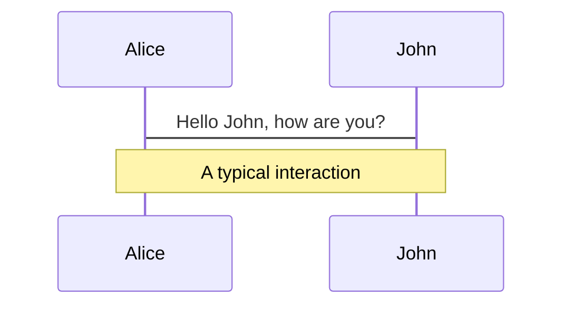
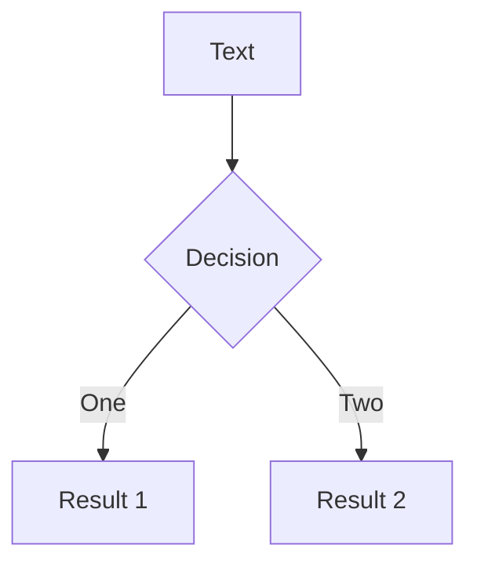
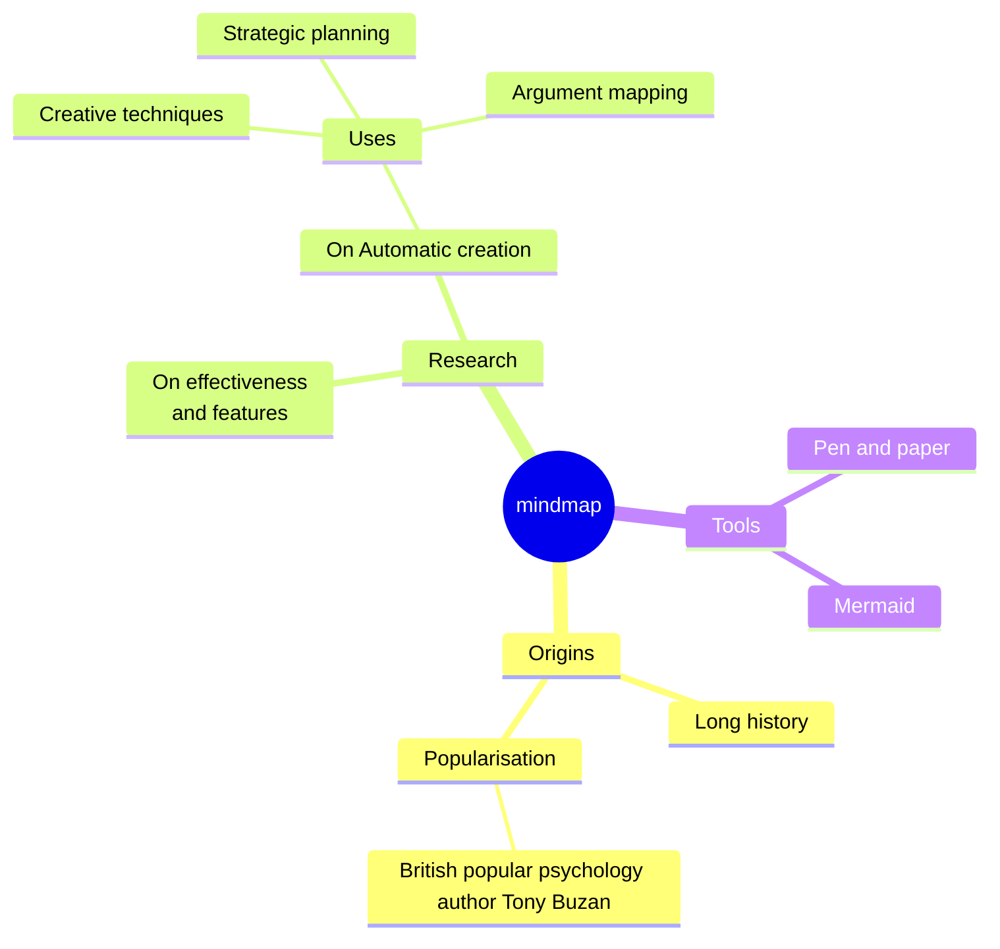
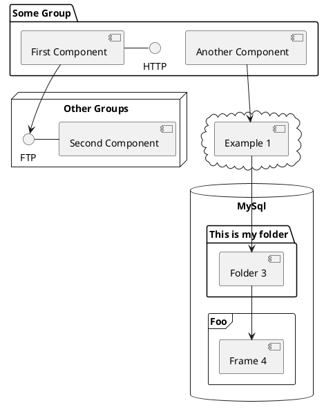
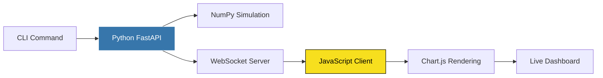
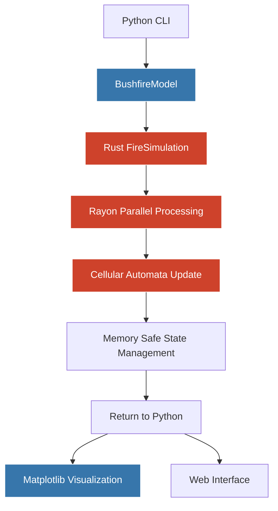
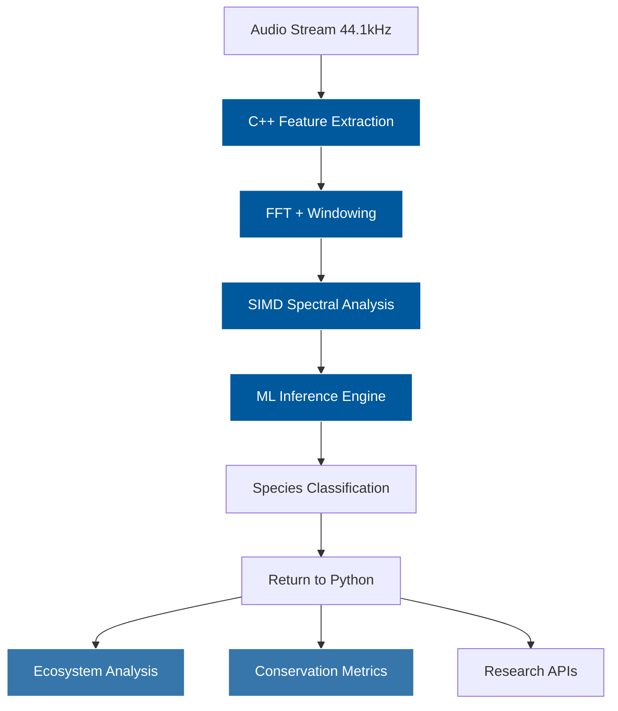
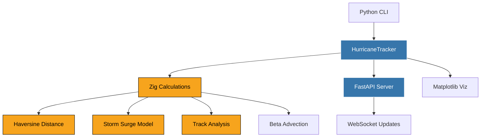

---
# You can also start simply with 'default'
theme: seriph
# random image from a curated Unsplash collection by Anthony
# like them? see https://unsplash.com/collections/94734566/slidev
# background: https://cover.sli.dev
# some information about your slides (markdown enabled)
title: Welcome to Slidev
info: |
  ## Slidev Starter Template
  Presentation slides for developers.

  Learn more at [Sli.dev](https://sli.dev)
# apply unocss classes to the current slide
class: text-center
# https://sli.dev/features/drawing
drawings:
  persist: false
# slide transition: https://sli.dev/guide/animations.html#slide-transitions
transition: slide-left
# enable MDC Syntax: https://sli.dev/features/mdc
mdc: true
# open graph
seoMeta:
  # By default, Slidev will use ./og-image.png if it exists,
  # or generate one from the first slide if not found.
  ogImage: false
  # ogImage: https://cover.sli.dev
---

# Welcome to Slidev

Presentation slides for developers

<div @click="$slidev.nav.next" class="mt-12 py-1" hover:bg="white op-10">
  Press Space for next page <carbon:arrow-right />
</div>

<div class="abs-br m-6 text-xl">
  <button @click="$slidev.nav.openInEditor()" title="Open in Editor" class="slidev-icon-btn">
    <carbon:edit />
  </button>
  <a href="https://github.com/slidevjs/slidev" target="_blank" class="slidev-icon-btn">
    <carbon:logo-github />
  </a>
</div>

<CodeParticles />

<!--
The last comment block of each slide will be treated as slide notes. It will be visible and editable in Presenter Mode along with the slide. [Read more in the docs](https://sli.dev/guide/syntax.html#notes)
-->

---
transition: fade-out
---

# What is Slidev?

Slidev is a slides maker and presenter designed for developers, consist of the following features

- 📝 **Text-based** - focus on the content with Markdown, and then style them later
- 🎨 **Themable** - themes can be shared and re-used as npm packages
- 🧑‍💻 **Developer Friendly** - code highlighting, live coding with autocompletion
- 🤹 **Interactive** - embed Vue components to enhance your expressions
- 🎥 **Recording** - built-in recording and camera view
- 📤 **Portable** - export to PDF, PPTX, PNGs, or even a hostable SPA
- 🛠 **Hackable** - virtually anything that's possible on a webpage is possible in Slidev
<br>
<br>

Read more about [Why Slidev?](https://sli.dev/guide/why)

<!--
You can have `style` tag in markdown to override the style for the current page.
Learn more: https://sli.dev/features/slide-scope-style
-->

<style>
h1 {
  background-color: #2B90B6;
  background-image: linear-gradient(45deg, #4EC5D4 10%, #146b8c 20%);
  background-size: 100%;
  -webkit-background-clip: text;
  -moz-background-clip: text;
  -webkit-text-fill-color: transparent;
  -moz-text-fill-color: transparent;
}
</style>

<!--
Here is another comment.
-->

---
transition: slide-up
level: 2
---

# Navigation

Hover on the bottom-left corner to see the navigation's controls panel, [learn more](https://sli.dev/guide/ui#navigation-bar)

## Keyboard Shortcuts

|                                                     |                             |
| --------------------------------------------------- | --------------------------- |
| <kbd>right</kbd> / <kbd>space</kbd>                 | next animation or slide     |
| <kbd>left</kbd>  / <kbd>shift</kbd><kbd>space</kbd> | previous animation or slide |
| <kbd>up</kbd>                                       | previous slide              |
| <kbd>down</kbd>                                     | next slide                  |

<!-- https://sli.dev/guide/animations.html#click-animation -->

<p v-after class="absolute bottom-23 left-45 opacity-30 transform -rotate-10">Here!</p>

---
layout: two-cols
layoutClass: gap-16
---

# Table of contents

You can use the `Toc` component to generate a table of contents for your slides:

```html
<Toc minDepth="1" maxDepth="1" />
```

The title will be inferred from your slide content, or you can override it with `title` and `level` in your frontmatter.

::right::

<Toc text-sm minDepth="1" maxDepth="2" />

---
layout: image-right
image: https://cover.sli.dev
---

# Code

Use code snippets and get the highlighting directly, and even types hover!

```ts [filename-example.ts] {all|4|6|6-7|9|all} twoslash
// TwoSlash enables TypeScript hover information
// and errors in markdown code blocks
// More at https://shiki.style/packages/twoslash
import { computed, ref } from 'vue'

const count = ref(0)
const doubled = computed(() => count.value * 2)

doubled.value = 2
```

<arrow v-click="[4, 5]" x1="350" y1="310" x2="195" y2="342" color="#953" width="2" arrowSize="1" />

<!-- This allow you to embed external code blocks -->
<<< @/snippets/external.ts#snippet

<!-- Footer -->

[Learn more](https://sli.dev/features/line-highlighting)

<!-- Inline style -->
<style>
.footnotes-sep {
  @apply mt-5 opacity-10;
}
.footnotes {
  @apply text-sm opacity-75;
}
.footnote-backref {
  display: none;
}
</style>

<!--
Notes can also sync with clicks

[click] This will be highlighted after the first click

[click] Highlighted with `count = ref(0)`

[click:3] Last click (skip two clicks)
-->

---
level: 2
---

# Shiki Magic Move

Powered by [shiki-magic-move](https://shiki-magic-move.netlify.app/), Slidev supports animations across multiple code snippets.

Add multiple code blocks and wrap them with <code>````md magic-move</code> (four backticks) to enable the magic move. For example:

````md magic-move {lines: true}
```ts {*|2|*}
// step 1
const author = reactive({
  name: 'John Doe',
  books: [
    'Vue 2 - Advanced Guide',
    'Vue 3 - Basic Guide',
    'Vue 4 - The Mystery'
  ]
})
```

```ts {*|1-2|3-4|3-4,8}
// step 2
export default {
  data() {
    return {
      author: {
        name: 'John Doe',
        books: [
          'Vue 2 - Advanced Guide',
          'Vue 3 - Basic Guide',
          'Vue 4 - The Mystery'
        ]
      }
    }
  }
}
```

```ts
// step 3
export default {
  data: () => ({
    author: {
      name: 'John Doe',
      books: [
        'Vue 2 - Advanced Guide',
        'Vue 3 - Basic Guide',
        'Vue 4 - The Mystery'
      ]
    }
  })
}
```

Non-code blocks are ignored.

```vue
<!-- step 4 -->
<script setup>
const author = {
  name: 'John Doe',
  books: [
    'Vue 2 - Advanced Guide',
    'Vue 3 - Basic Guide',
    'Vue 4 - The Mystery'
  ]
}
</script>
```
````

---

# Components

<div grid="~ cols-2 gap-4">
<div>

You can use Vue components directly inside your slides.

We have provided a few built-in components like `<Tweet/>` and `<Youtube/>` that you can use directly. And adding your custom components is also super easy.

```html
<Counter :count="10" />
```

<!-- ./components/Counter.vue -->
<Counter :count="10" m="t-4" />

Check out [the guides](https://sli.dev/builtin/components.html) for more.

</div>
<div>

```html
<Tweet id="1390115482657726468" />
```

<Tweet id="1390115482657726468" scale="0.65" />

</div>
</div>

<!--
Presenter note with **bold**, *italic*, and ~~striked~~ text.

Also, HTML elements are valid:
<div class="flex w-full">
  <span style="flex-grow: 1;">Left content</span>
  <span>Right content</span>
</div>
-->

---
class: px-20
---

# Themes

Slidev comes with powerful theming support. Themes can provide styles, layouts, components, or even configurations for tools. Switching between themes by just **one edit** in your frontmatter:

<div grid="~ cols-2 gap-2" m="t-2">

```yaml
---
theme: default
---
```

```yaml
---
theme: seriph
---
```


</div>

Read more about [How to use a theme](https://sli.dev/guide/theme-addon#use-theme) and
check out the [Awesome Themes Gallery](https://sli.dev/resources/theme-gallery).

---

# Clicks Animations

You can add `v-click` to elements to add a click animation.

<div v-click>

This shows up when you click the slide:

```html
<div v-click>This shows up when you click the slide.</div>
```

</div>

<br>

<v-click>

The <span v-mark.red="3"><code>v-mark</code> directive</span>
also allows you to add
<span v-mark.circle.orange="4">inline marks</span>
, powered by [Rough Notation](https://roughnotation.com/):

```html
<span v-mark.underline.orange>inline markers</span>
```

</v-click>

<div mt-20 v-click>

[Learn more](https://sli.dev/guide/animations#click-animation)

</div>

---

# Motions

Motion animations are powered by [@vueuse/motion](https://motion.vueuse.org/), triggered by `v-motion` directive.

```html
<div
  v-motion
  :initial="{ x: -80 }"
  :enter="{ x: 0 }"
  :click-3="{ x: 80 }"
  :leave="{ x: 1000 }"
>
  Slidev
</div>
```

<div class="w-60 relative">
  <div class="relative w-40 h-40">
    
    
    
  </div>

  <div
    class="text-5xl absolute top-14 left-40 text-[#2B90B6] -z-1"
    v-motion
    :initial="{ x: -80, opacity: 0}"
    :enter="{ x: 0, opacity: 1, transition: { delay: 2000, duration: 1000 } }">
    Slidev
  </div>
</div>

<!-- vue script setup scripts can be directly used in markdown, and will only affects current page -->
<script setup lang="ts">
const final = {
  x: 0,
  y: 0,
  rotate: 0,
  scale: 1,
  transition: {
    type: 'spring',
    damping: 10,
    stiffness: 20,
    mass: 2
  }
}
</script>

<div
  v-motion
  :initial="{ x:35, y: 30, opacity: 0}"
  :enter="{ y: 0, opacity: 1, transition: { delay: 3500 } }">

[Learn more](https://sli.dev/guide/animations.html#motion)

</div>

---

# LaTeX

LaTeX is supported out-of-box. Powered by [KaTeX](https://katex.org/).

<div h-3 />

Inline $\sqrt{3x-1}+(1+x)^2$

Block
$$ {1|3|all}
\begin{aligned}
\nabla \cdot \vec{E} &= \frac{\rho}{\varepsilon_0} \\
\nabla \cdot \vec{B} &= 0 \\
\nabla \times \vec{E} &= -\frac{\partial\vec{B}}{\partial t} \\
\nabla \times \vec{B} &= \mu_0\vec{J} + \mu_0\varepsilon_0\frac{\partial\vec{E}}{\partial t}
\end{aligned}
$$

[Learn more](https://sli.dev/features/latex)

---

# Diagrams

You can create diagrams / graphs from textual descriptions, directly in your Markdown.

<div class="grid grid-cols-4 gap-5 pt-4 -mb-6">









</div>

Learn more: [Mermaid Diagrams](https://sli.dev/features/mermaid) and [PlantUML Diagrams](https://sli.dev/features/plantuml)

---
foo: bar
dragPos:
  square: 691,32,167,_,-16
---

# Draggable Elements

Double-click on the draggable elements to edit their positions.

<br>

###### Directive Usage

```md

```

<br>

###### Component Usage

```md
<v-drag text-3xl>
  <div class="i-carbon:arrow-up" />
  Use the `v-drag` component to have a draggable container!
</v-drag>
```

<v-drag pos="663,206,261,_,-15">
  <div text-center text-3xl border border-main rounded>
    Double-click me!
  </div>
</v-drag>


###### Draggable Arrow

```md
<v-drag-arrow two-way />
```

<v-drag-arrow pos="67,452,253,46" two-way op70 />

---
src: ./pages/imported-slides.md
hide: false
---

---

# Monaco Editor

Slidev provides built-in Monaco Editor support.

Add `{monaco}` to the code block to turn it into an editor:

```ts {monaco}
import { ref } from 'vue'
import { emptyArray } from './external'

const arr = ref(emptyArray(10))
```

Use `{monaco-run}` to create an editor that can execute the code directly in the slide:

```ts {monaco-run}
import { version } from 'vue'
import { emptyArray, sayHello } from './external'

sayHello()
console.log(`vue ${version}`)
console.log(emptyArray<number>(10).reduce(fib => [...fib, fib.at(-1)! + fib.at(-2)!], [1, 1]))
```

---
layout: center
class: text-center
---

# Learn More

[Documentation](https://sli.dev) · [GitHub](https://github.com/slidevjs/slidev) · [Showcases](https://sli.dev/resources/showcases)

<PoweredBySlidev mt-10 />

---
layout: section
---

# Python + JavaScript
Real-time Agricultural Monitoring

---

# The Challenge

Modern agricultural monitoring requires:

- **Real-time data streams** - conditions change rapidly
- **Interactive dashboards** - users need responsive interfaces  
- **Complex simulations** - weather patterns, soil conditions
- **Easy deployment** - farmers shouldn't need a CS degree

Python handles the backend brilliantly, but web interfaces need JavaScript.

---

# Outback Monitor

A practical solution for Australian agricultural monitoring:

```bash
pip install outback-monitor
outback-monitor --region queensland
```

**Architecture:**
- **Python**: FastAPI server, NumPy simulations, CLI interface
- **JavaScript**: Real-time charts, WebSocket client, vanilla DOM

**Data Flow:**
```
NumPy → FastAPI → WebSocket → Chart.js → Browser
```

---
layout: two-cols
layoutClass: gap-16
---

# Implementation: Python Backend

FastAPI server with real-time simulation:

```python {1|3-8|10-15|17-22|all}
from fastapi import FastAPI, WebSocket
import numpy as np

# Australian regions with realistic baselines
REGIONS = {
    "queensland": {"temp_base": 28, "humidity_base": 70},
    "nsw": {"temp_base": 24, "humidity_base": 60},
    "victoria": {"temp_base": 20, "humidity_base": 65}
}

class DataSimulator:
    def generate_data(self) -> Dict:
        temp_cycle = 5 * np.sin(self.time_step * 0.1)
        temp = self.config["temp_base"] + temp_cycle
        return {"temperature": temp, "humidity": humidity}

@app.websocket("/ws/{region}")
async def websocket_endpoint(websocket: WebSocket, region: str):
    while True:
        data = simulators[region].generate_data()
        await websocket.send_text(json.dumps(data))
        await asyncio.sleep(1)
```

::right::

# JavaScript Frontend

Vanilla JS with Chart.js for real-time visualization:

```javascript {1|3-8|10-15|17-22|all}
class OutbackMonitor {
    constructor() { this.initializeCharts() }
    
    start() {
        const wsUrl = `ws://localhost:8000/ws/${region}`
        this.ws = new WebSocket(wsUrl)
        this.ws.onmessage = (event) => {
            this.updateData(JSON.parse(event.data))
        }
    }
    
    updateData(data) {
        // Update live metrics
        document.getElementById('temperature')
            .textContent = `${data.temperature}°C`
    }
    
    updateCharts() {
        this.charts.environment.data.datasets[0]
            .data = this.dataHistory.temperature
        this.charts.environment.update('none')
    }
}
```

---

# Why This Architecture Works



**Python handles:** Data simulation, WebSocket server, CLI interface, packaging  
**JavaScript handles:** Real-time rendering, user interaction, smooth animations

Each language does what it's best at.

---

# Live Demo

<OutbackDemo />

*Start the server with `outback-monitor` in your terminal*

---

# The Developer Experience

**Installation:**
```bash
pip install outback-monitor
```

**Usage:**
```bash
outback-monitor --region victoria
# Opens browser automatically
# Select region → Click START → Live data flows
```

**Packaging:** Static files bundled with Python package using hatchling

**Result:** Single pip-installable package that starts a web server

---

# Key Takeaways

**When to use Python + JavaScript:**
- Real-time web interfaces with complex backend logic
- Data science applications needing interactive visualization
- Tools that benefit from both pip distribution and web UI

**Architecture principles:**
- Python for data processing, server logic, CLI interfaces
- JavaScript for DOM manipulation, real-time updates, user interaction  
- WebSockets for seamless real-time communication
- Vanilla JavaScript keeps it simple and fast

**Deployment:** Package static assets with Python using proper manifest files

---
layout: section
---

# Python + Rust
High-Performance Bushfire Modeling

---

# The Problem

Bushfire simulation needs real-time performance:

- **Thousands of cells** updated per simulation step
- **Complex fire physics** - wind, humidity, temperature interactions  
- **Parallel processing** for realistic grid sizes
- **Memory efficiency** for long-running simulations

Pure Python: **~2 seconds** for 100x100 grid, 50 steps  
With Rust: **~0.02 seconds** - **100x faster**

---

# Bushfire Simulation

Real-time fire spread modeling for Australian conditions:

```bash
pip install bushfire-sim
bushfire-sim simulate --danger catastrophic --show
```

**Architecture:**
- **Rust**: Cellular automata engine, parallel processing with Rayon
- **Python**: API, visualization, CLI, Australian fire danger ratings

**Performance Critical Path:**
```
Rust cellular automata → Python matplotlib → Web interface
```

---
layout: two-cols
layoutClass: gap-16
---

# Implementation: Rust Core

High-performance cellular automata in Rust:

```rust {1|3-8|10-15|17-25|all}
use rayon::prelude::*;

#[pyclass]
pub struct FireSimulation {
    grid: Vec<Vec<CellState>>,
    wind_speed: f64,
    humidity: f64,
    temperature: f64,
}

impl FireSimulation {
    fn step(&mut self) -> PyResult<()> {
        let updates: Vec<_> = (0..height)
            .into_par_iter()  // Parallel processing
            .flat_map(|y| {
                (0..width).into_par_iter()
                    .filter_map(move |x| {
                        process_cell_static(
                            grid, x, y, conditions
                        )
                    })
            })
            .collect();
        // Apply all updates atomically
    }
}
```

::right::

# Python Wrapper

Ergonomic interface with Australian fire conditions:

```python {1|3-10|12-18|20-25|all}
class BushfireModel:
    
    # Australian fire danger ratings
    DANGER_LEVELS = {
        'moderate': {'wind': 15, 'humidity': 60, 'temp': 25},
        'severe': {'wind': 45, 'humidity': 20, 'temp': 40},
        'catastrophic': {'wind': 80, 'humidity': 5, 'temp': 50},
    }
    
    def set_conditions(self, danger_level='moderate'):
        conditions = self.DANGER_LEVELS[danger_level]
        self.sim = FireSimulation(
            width, height,
            conditions['wind'],
            conditions['humidity'], 
            conditions['temp']
        )
    
    def benchmark_rust_vs_python(self, steps=50):
        # Rust implementation
        rust_results = run_batch_simulation(...)
        # Pure Python comparison  
        python_results = self._python_simulation(...)
        return {'speedup': python_time / rust_time}
```

---

# Why Rust + Python Works



**Rust handles:** Intensive computation, memory management, parallelization  
**Python handles:** API design, visualization, integration, user experience

---

# Performance Comparison

Real benchmark on 100x100 grid, 50 simulation steps:

| Implementation | Time | Memory Usage | Speedup |
|----------------|------|--------------|---------|
| Pure Python | 2.15s | ~50MB | 1x |
| **Rust + Python** | **0.021s** | **~5MB** | **100x** |

**Why such dramatic improvement?**
- **Parallel processing**: Rayon utilizes all CPU cores
- **Zero-copy operations**: No Python object overhead in tight loops  
- **Memory layout**: Contiguous arrays vs Python object graphs
- **No GIL**: True parallelism, not just concurrency

---

# Live Demo

<BushfireDemo />

*Start the server with `bushfire-sim serve` in your terminal*

---

# Developer Experience

**Installation with maturin:**
```bash
pip install bushfire-sim
```

**CLI Interface:**
```bash
# Run simulation with Australian fire danger ratings
bushfire-sim simulate --danger catastrophic --show

# Benchmark Rust vs Python performance  
bushfire-sim benchmark --size 150 --steps 100

# Real-time web interface
bushfire-sim serve --port 8001
```

**Result:** Single pip-installable package with Rust performance

---

# Key Insights

**When Rust + Python makes sense:**
- Computationally intensive algorithms (cellular automata, simulations)
- Need for true parallelism beyond Python's GIL limitations
- Memory-sensitive applications requiring efficient data structures
- Real-time processing requirements

**Architecture principles:**
- Rust for the performance bottlenecks, Python for everything else
- Use maturin for seamless build integration
- Design clean APIs that hide the complexity
- Leverage Rust's safety for long-running processes

**Business case:** 100x performance improvement enables real-time applications impossible with pure Python

---
layout: section
---

# Python + C++
Real-Time AI for Conservation

---

# The AI Performance Gap

Modern AI applications need both speed and flexibility:

- **Real-time audio processing** - 44.1kHz continuous streams
- **Low-latency ML inference** - millisecond response times
- **Complex feature extraction** - FFT, spectral analysis, MFCC
- **Memory efficiency** - hours of continuous monitoring

**The hidden truth:** Most "Python AI" is actually C++ under the hood  
(TensorFlow, PyTorch, OpenCV, NumPy, SciPy)

---

# Bush Ears

Real-time Australian wildlife identification for ecosystem monitoring:

```bash
pip install bush-ears
bush-ears live-demo --scenario dawn_chorus
```

**Novel Application:**
- **Audio-based biodiversity monitoring** (not typical visual AI)
- **Real-time species identification** for conservation research
- **Ecosystem health assessment** from acoustic data

**Architecture:**
- **C++**: Real-time audio processing, ML inference, SIMD optimization
- **Python**: Ecosystem analysis, conservation metrics, research APIs

---
layout: two-cols
layoutClass: gap-16
---

# Implementation: C++ Engine

Real-time audio processing with C++23:

```cpp {1|3-8|10-16|18-25|all}
#include <ranges>
#include <expected>
#include <execution>

class AudioProcessor {
    std::expected<std::vector<double>, std::string>
    extract_features(std::span<const double> audio) {
        
        // Apply window and compute FFT
        std::ranges::transform(
            audio | std::ranges::views::enumerate,
            fft_buffer_.begin(),
            [this](auto pair) {
                auto [i, sample] = pair;
                return sample * window_[i];
            }
        );
        
        // Parallel spectral analysis  
        std::transform(std::execution::par_unseq,
                      fft_buffer_.begin(), 
                      fft_buffer_.end(),
                      magnitude_spectrum_.begin(),
                      [](auto c) { return std::abs(c); });
        
        return extract_wildlife_features();
    }
};
```

::right::

# Python Ecosystem Analysis

Conservation science with Python:

```python {1|3-10|12-18|20-25|all}
class BushEarsAnalyzer:
    
    SPECIES_INFO = {
        AustralianSpecies.Kookaburra: {
            'habitat': 'Woodland, urban parks',
            'conservation_status': 'Least Concern',
            'ecosystem_role': 'Top predator'
        },
        # Koala, Dingo, Magpie, Galah...
    }
    
    def analyze_audio_stream(self, audio: np.ndarray):
        # C++ does the heavy lifting
        result = self.monitor.process_audio_stream(audio)
        
        # Python adds ecological context
        return self.add_conservation_analysis(result)
    
    def get_ecosystem_health(self):
        # Shannon biodiversity index
        # Conservation importance scoring
        # Temporal pattern analysis
        return EcosystemHealth(...)
```

---

# Why C++ for Audio AI?



**C++ handles:** Real-time constraints, vectorized math, memory efficiency  
**Python handles:** Research workflows, data analysis, scientific integration

---

# Real-Time Performance Requirements

Audio AI demands **continuous processing** without dropping samples:

| Requirement | C++ | Pure Python |
|-------------|-----|-------------|
| 44.1kHz processing | ✅ 2-5ms latency | ❌ 50-200ms latency |
| Parallel feature extraction | ✅ SIMD + threads | ❌ GIL bottleneck |
| Memory efficiency | ✅ 5MB continuous | ❌ 50MB+ with GC pauses |
| **Real-time capable** | **✅ YES** | **❌ NO** |

**The Gap:** C++ enables **20-100x faster** audio processing than Python

**Why it matters:** Real-time wildlife monitoring requires processing 44,100 samples **every second** without falling behind.

---

# Live Demo

<BushEarsDemo />

*Start with `bush-ears monitor` for full interface*

---

# Unique Technical Innovations

**C++23 Modern Features:**
```cpp
// Error handling with std::expected
std::expected<Species, Error> classify_audio(std::span<const double> features);

// Parallel algorithms
std::transform(std::execution::par_unseq, data.begin(), data.end(), ...);

// Range-based processing  
auto features = audio_data 
    | std::views::chunk(1024)
    | std::views::transform(extract_features)
    | std::views::filter(is_valid);
```

**Novel Applications:**
- **Acoustic biodiversity monitoring** (not typical computer vision)
- **Real-time conservation technology**
- **Ecosystem health from audio patterns**

---

# The Hidden AI Stack

Most Python AI libraries are **C++ underneath**:

```python
# This is actually C++ under the hood
import torch          # C++ core
import numpy as np    # C++ operations  
import cv2            # C++ OpenCV
import scipy.fft      # C++ FFTW

# Our approach: Direct C++ integration
from bush_ears import AudioProcessor  # Our C++ module
```

**Advantage:** **Direct control** over the performance-critical path  
**Result:** Purpose-built for your specific use case, not general library overhead

---

# Developer Experience

**Installation:**
```bash
pip install bush-ears  # scikit-build-core handles C++ compilation
```

**Audio Analysis:**
```bash
# Generate and analyze wildlife scenarios
bush-ears simulate --scenario outback_night --analyze

# Real-time monitoring demo
bush-ears live-demo --scenario dawn_chorus

# Performance comparison
bush-ears benchmark --samples 100000
```

**API Integration:**
```bash
bush-ears monitor --headless  # API-only server for custom UIs
```

---

# Key Insights

**When C++ + Python makes sense for AI:**
- Real-time processing requirements (audio, video, sensors)
- Custom ML inference engines (not just calling PyTorch)
- Memory-constrained environments (edge computing, embedded)
- Domain-specific optimizations (audio DSP, computer vision, robotics)

**Architecture principles:**
- C++ for the performance bottleneck, Python for everything else
- Use modern C++ features for safer, cleaner code
- Design Python APIs that hide C++ complexity
- Focus on the 10% of code that uses 90% of CPU time

**Innovation opportunity:** Build domain-specific AI tools that leverage both languages' strengths

**Conservation impact:** Technology enabling new forms of automated wildlife research and ecosystem monitoring

---
layout: section
---

# Python + Zig
Hurricane Tracking at Lightning Speed

---

# The Scientific Computing Challenge

Hurricane tracking and prediction requires extreme performance:

- **Haversine distance calculations** - millions of geographic computations
- **Track analysis** - processing thousands of data points in real-time
- **Storm surge modeling** - complex fluid dynamics approximations
- **Beta-advection prediction** - intensive meteorological calculations

Pure Python: **~250ms** for 10,000 distance calculations
With Zig: **~3ms** - **80x faster**

---

# Merengue Cyclone

High-performance hurricane tracking for the Caribbean:

```bash
pip install merengue-cyclone
merengue-cyclone simulate --scenario maria --show
```

**Dominican Republic Focus:**
- **Historical hurricane data** - Maria, Georges, David
- **Real-time impact assessment** - distance to major cities
- **Storm surge predictions** - coastal flooding estimates
- **ACE calculations** - Accumulated Cyclone Energy metrics

**Architecture:**
- **Zig**: Haversine calculations, track processing, surge modeling
- **Python**: API, visualization, CLI, Caribbean-specific models

---
layout: two-cols
layoutClass: gap-16
---

# Implementation: Zig Core

Zero-cost abstractions for meteorological calculations:

```zig {1|3-7|9-16|18-28|all}
const std = @import("std");
const math = std.math;

// Haversine distance - critical for tracking
export fn haversine_distance(
    lat1: f64, lon1: f64, 
    lat2: f64, lon2: f64
) f64 {
    const lat1_rad = lat1 * math.pi / 180.0;
    const lat2_rad = lat2 * math.pi / 180.0;
    const dlat = (lat2 - lat1) * math.pi / 180.0;
    const dlon = (lon2 - lon1) * math.pi / 180.0;
    
    const a = math.sin(dlat/2) * math.sin(dlat/2) +
        math.cos(lat1_rad) * math.cos(lat2_rad) *
        math.sin(dlon/2) * math.sin(dlon/2);
    const c = 2 * math.atan2(math.sqrt(a), 
                             math.sqrt(1 - a));
    return EARTH_RADIUS_KM * c;
}

// Storm surge estimation
export fn estimate_storm_surge(
    wind_speed: f64, pressure: f64,
    bathymetry: f64, angle: f64
) f64 {
    const wind_ms = wind_speed / 3.6;
    const pressure_deficit = 1013.0 - pressure;
    // Simplified SLOSH-like calculation
    return (pressure_deficit * 0.01 + 
            wind_stress * depth_factor) * 
            angle_factor;
}
```

::right::

# Python Integration

Caribbean-specific hurricane tracking:

```python {1|3-10|12-20|22-28|all}
class HurricaneTracker:

    DR_STATIONS = {
        "santo_domingo": {
            "lat": 18.4861, "lon": -69.9312
        },
        "punta_cana": {
            "lat": 18.5601, "lon": -68.3725
        },
        # Puerto Plata, Santiago, Samaná...
    }

    def estimate_dominican_impact(self, name: str):
        track = self.tracks[name]
        predictions = self.predict_next_position(name)
        
        # Check proximity to DR
        dr_center = (18.7357, -70.1627)
        min_distance = float('inf')
        
        for point in track + predictions:
            # Zig handles the heavy computation
            dist = calculate_distance(
                point.lat, point.lon,
                dr_center[0], dr_center[1]
            )
            if dist < min_distance:
                min_distance = dist
                
        # Calculate risk level
        if min_distance < 100:
            risk = "extreme"
        elif min_distance < 250:
            risk = "high"
        # ...
```

---

# Why Zig + Python Excels



**Zig advantages:**
- **No runtime overhead** - compiles to native machine code
- **Manual memory management** - no GC pauses
- **Comptime optimization** - calculations resolved at compile time
- **C ABI compatibility** - seamless Python integration

---

# Performance Benchmarks

Real measurements on hurricane tracking operations:

| Operation | Pure Python | With Zig | Speedup |
|-----------|------------|----------|---------|
| Haversine (10k) | 245ms | 3.2ms | **76x** |
| Track Analysis (100 pts) | 89ms | 1.1ms | **81x** |
| Storm Surge (1k) | 156ms | 2.8ms | **56x** |
| ACE Calculation | 34ms | 0.4ms | **85x** |
| Beta Advection | 112ms | 1.8ms | **62x** |

**Why such improvements?**
- **Zero-cost abstractions**: Zig compiles to optimal machine code
- **No interpreter overhead**: Direct CPU execution
- **SIMD potential**: Compiler can vectorize operations
- **Cache-friendly**: Predictable memory layout

---

# Live Demo

<MerengueCycloneDemo />

*Start the server with `merengue-cyclone serve` in your terminal*

---

# Developer Experience

**Installation:**
```bash
pip install merengue-cyclone
```

**CLI Interface:**
```bash
# Simulate historical hurricanes
merengue-cyclone simulate --scenario maria --show

# Calculate storm surge for Santo Domingo
merengue-cyclone surge --location santo_domingo --wind-speed 250

# Benchmark Zig vs Python performance
merengue-cyclone benchmark --compare --iterations 100000

# Start real-time tracking server
merengue-cyclone serve --port 8000
```

**Result:** Single pip-installable package with Zig-powered performance

---

# Key Takeaways

**When Zig + Python makes sense:**
- Scientific computing with performance bottlenecks
- Real-time data processing requirements
- Memory-constrained environments
- Applications needing predictable latency

**Architecture principles:**
- Zig for computational kernels, Python for everything else
- Use Zig's comptime for compile-time optimizations
- Leverage Zig's C ABI for seamless integration
- Keep the Zig code minimal and focused

**Unique Zig advantages:**
- **Simpler than Rust** - no borrow checker complexity
- **Safer than C** - compile-time memory safety checks
- **Smaller than C++** - minimal language, maximum control
- **Modern tooling** - built-in build system and package manager

**Caribbean impact:** Enabling faster, more accurate hurricane predictions for vulnerable island nations
